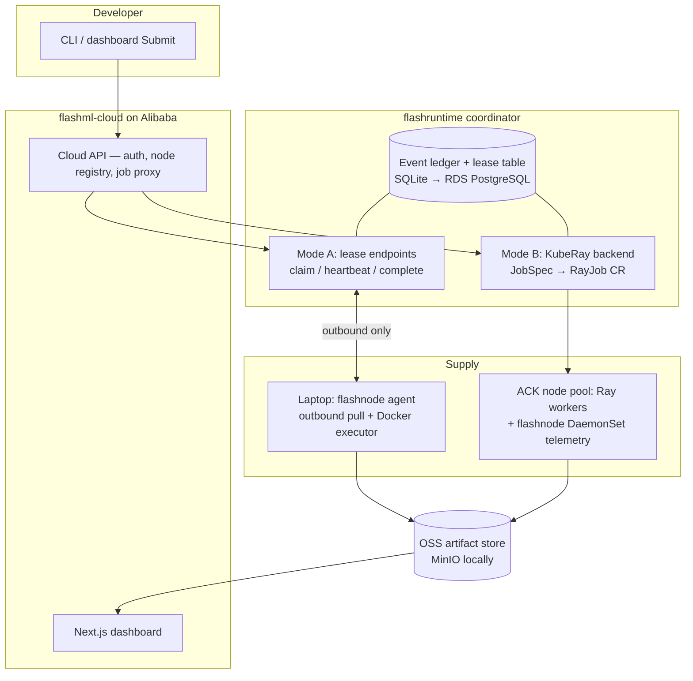

# FlashML — Careful Rebuild Plan (smallest POC → Alibaba, 2 weeks)

> **STATUS (2026-07-19): the local half of this plan is complete** — see
> `PROGRESS.md` for the authoritative stage checklist and per-stage log.
> Stages 1–4, 6 (local half), and 7 are done (implemented directly in the
> repos rather than in `rebuild/` scratch — the user redirected mid-plan
> from learn-by-rebuilding to direct implementation). Open: Stage 8
> (ledger metrics + case study), the real-second-machine run
> (`e2e/README.md` runbook), and Stage 5 (Alibaba, gated on credentials).
> This file remains as the original plan and the Alibaba runbook.

Goal: **re-implement the POC from the smallest possible piece upward, for
understanding** — not to reuse the July 17–18 POC as-is. The existing code
stays untouched and serves as the *answer key*: after you build each stage
yourself, compare with the corresponding existing file to see what a finished
version looks like.

Companions: `FlashML_Master_Product_Architecture_and_Strategy_Report.docx`
(strategy), `archive/POC_REPORT.md` (what the previous POC proved).

---

## Part I — The architecture you are building, and why

### The one idea underneath everything

FlashML's entire technical core is a single pattern, applied at growing scale:

> **Work is never *pushed* to a machine. A machine *pulls* a time-limited
> lease on a task, proves liveness with heartbeats, and only the first
> attempt to commit a valid result wins.**

Everything else — Kubernetes, Ray, Alibaba, dashboards — is packaging around
this pattern. If a machine dies, nothing needs to "handle" it: its lease
simply expires and the task becomes claimable again. This is why the system
tolerates laptops closing lids and pods being killed with the same code path.

Why *pull* and not push? Because contributed devices sit behind home routers
and NAT. A pull model needs only **outbound** HTTP/WebSocket from the device
— no port forwarding, no inbound SSH — which is the master report's §5.1
security requirement and the reason "any laptop can join" is feasible at all.

### The three repos, restated as roles in that pattern

| Repo | Role in the pattern | Trust boundary |
|---|---|---|
| **flashruntime** (public) | Defines the *contract*: what a Job/Task/Lease/Attempt/Event/Checkpoint IS (pydantic schemas, `protocol/v1alpha1`) and runs the coordinator logic (lease table, expiry sweep, ledger) | Must be self-hostable and inspectable — it is the credibility layer |
| **flashnode** (public) | The *worker side* of the pattern: identity, capability report, claim → execute (sandboxed) → heartbeat → upload → commit | Runs on strangers' machines → minimal, open, explicit permissions |
| **flashml-cloud** (private) | The *business wrapper*: who may submit, which nodes are trusted, dashboards, credits, and later billing/scheduling intelligence | Where the moat (reliability data, economics) accumulates — never open |

Dependency rule (already enforced): flashnode and flashml-cloud import
`flashruntime.protocol` and nothing else crosses repo boundaries.

### Two execution modes — keep them mentally separate

- **Mode A — independent tasks (lease-based).** Hyperparameter trials,
  data shards, batch inference. Any device can serve these via the pull
  pattern. *This is what you build first, by hand.*
- **Mode B — coordinated groups (cluster-based).** Ray jobs, multi-worker
  training. Requires machines that can talk to each other with low latency →
  only runs on managed pools (Kubernetes/KubeRay, later PAI-DLC). Here
  FlashML does **not** re-implement fault tolerance; Kubernetes replaces
  pods, Ray retries tasks, and flashruntime *observes, records, and reports*
  it as a typed event timeline.

The previous POC only built Mode B (KubeRay). Mode A — the part FlashML must
truly own — was left as scaffold. Your rebuild does the opposite: **Mode A
first, from scratch, then re-derive Mode B.**

### Target architecture (end of week 2)

### Service choices — local stand-in, Alibaba service, and why

Rule: every external dependency hides behind a small protocol/interface you
own, so the local and cloud profiles are the *same code with different
config* (this already proved itself: `ArtifactStore` has MinIO and OSS
implementations selected by one env var).

| Capability | Local (learn here) | Alibaba (deploy here) | Why this service / notes |
|---|---|---|---|
| Object storage (artifacts, checkpoints) | MinIO in Docker | **OSS** (`oss2` SDK, STS creds) | S3-model storage decouples data from node lifetime; interface: `ArtifactStore` |
| Container images | local registry :5001 | **ACR** | kind-load is broken on Docker 29 (see memory); registry pattern works in both worlds; immutable tags `poc-v1-<sha>` |
| Managed Kubernetes (Mode B pool) | kind on colima | **ACK** | Pod replacement = free node-level recovery for Mode B; manifests already in `infra/` |
| Durable control state (ledger, leases, registry) | SQLite file | **ApsaraDB RDS for PostgreSQL** | Append-only event schema; SQLite is fine until multi-replica API (Day 10) |
| Lease expiry / hot state | in-process asyncio sweep | same, or **Tair (Redis)** later | Do NOT start with Redis — an asyncio loop over the DB teaches the semantics; Redis is an optimization once QPS demands it |
| Logs | JSON to stdout, `kubectl logs` | **SLS** (Logtail add-on, `job_id` correlation) | Config already written in `infra/alibaba/sls/` |
| Metrics | none → simple ledger queries | **ARMS managed Prometheus** | Only wire after Day 14 metrics exist |
| Coordinator/API hosting | your Mac / docker compose | one small **ECS** first, then ACK | ECS-first keeps Stage 5 tiny; SAE (Serverless App Engine) is a fine alternative if you want zero VM ops |
| Credentials | env vars | **RAM roles + STS** tokens for OSS upload from devices | Never long-lived keys on contributed devices |
| Training pool (later) | — | **PAI-DLC** (ADR 0002) | Post-2-weeks; ACK GPU pool comes first |
| Device sandbox tier (later) | plain Docker limits | **Sandboxed-Container** runtime on ACK | Fail-closed translation already implemented/tested |

---

## Part II — The staged rebuild (day by day)

Rules: each stage ends with something you **run and watch**, plus 3–5 lines
in `PROGRESS.md` saying what you now understand. Build stages in a fresh
`rebuild/` area (Stage 0–1) then graduate code into the real repos; never
edit the old POC code — diff against it instead ("answer key" files listed
per stage).

### Stage 0 — the whole system in one file *(Day 1)*

**Idea learned:** lease, heartbeat, attempt, expiry, idempotent commit — the
entire FlashML core, with zero infrastructure.

**Build** `rebuild/stage0_minimal.py` (~200 lines, stdlib only):
- `Job` = dict with N tasks (e.g., "sum this slice of numbers").
- In-memory tables: `tasks`, `leases {task, worker, deadline, attempt_no}`,
  `events` (append-only list — this is the ledger).
- 3 worker **threads** loop: claim → work in small steps → heartbeat each
  step → commit. One worker is rigged to die mid-task.
- A sweeper thread expires stale leases → task returns to `PENDING`.
- Commit rule: first valid result per task wins; a late commit from the
  "dead" worker (make it wake up again!) must be **rejected** — print it.
- End: reduce results, then print the event log as a timeline.

**Verify:** timeline shows CLAIMED → HEARTBEAT… → LEASE_EXPIRED →
RECLAIMED → COMMITTED, job result is correct, late commit rejected.
**Answer key:** none — this file *is* the concept. Keep it forever as the
teaching artifact.

### Stage 1 — split into coordinator + agents over HTTP *(Days 2–3)*

**Idea learned:** the pull model across process boundaries; why the protocol
must be versioned schemas; the append-only ledger as the source of truth.

**Architecture:** two programs on one machine.
- **Coordinator** (seed of `flashruntime/service/` + `leases/`): FastAPI,
  SQLite. Endpoints (compare master §14.3):
  `POST /v1alpha1/jobs` · `POST /v1alpha1/leases/claim` (long-poll ok) ·
  `POST /v1alpha1/attempts/{id}/heartbeat` · `.../complete` · `.../fail` ·
  `GET /v1alpha1/jobs/{id}/events`. Background asyncio task sweeps expired
  leases. Every state change = one `Event` row; job status is *derived* from
  events, never stored as a mutable field you hand-edit.
- **Agent** (seed of `flashnode/agent/` + `executor/`): identity file
  (stable node id, generated once), register, then claim/heartbeat loop
  running the task as a Python function. Graceful SIGTERM: fail the attempt,
  exit.
- **Protocol**: pydantic models in one module — `JobSpec`, `Lease`,
  `AttemptResult`, `Event`, `NodeRegistration`, all with `apiVersion`.
  This module is the future `flashruntime.protocol.v1alpha1`.

**Verify (the first real demo):** two terminals running agents, submit an
8-task job, `Ctrl-C` one agent mid-task → watch the other agent pick up the
expired task; `GET /events` shows the full story; SQLite survives
coordinator restart.
**Answer keys:** `flashruntime/flashruntime/service/{app,ledger}.py`,
`flashruntime/flashruntime/protocol/v1alpha1.py`,
`flashnode/flashnode/agent/daemon.py`, `flashnode/flashnode/identity/store.py`.

### Stage 2 — sandboxed execution + durable artifacts *(Day 4)*

**Idea learned:** why the executor is a container, what the isolation ladder
is (Docker limits → gVisor → microVM → confidential, master §10.2), and why
artifacts must outlive nodes.

**Build:**
- Agent executor: task now = allowlisted Docker image + command.
  `docker run --rm --cpus 2 --memory 2g --network none --user nobody
  --read-only -v <workdir>` with a wall-clock timeout. Refuse any image not
  on the allowlist (fail closed — same principle as the sandbox-tier code).
- Artifact store: define a 4-method `ArtifactStore` protocol (put/get/
  presign/list), implement `MinIOStore` (MinIO via docker compose). Agent
  uploads output + sha256; commit request carries the hash; coordinator
  records an `ArtifactRecord`.
- Idempotent commit key = `jobid/taskid/output.json` — a second attempt
  writing the same key is the *rejected-late-commit* case from Stage 0, now
  with real storage.

**Verify:** kill the container mid-run (docker kill) → lease expires →
retry on other agent → exactly one artifact per task in MinIO.
**Answer key:** `flashruntime/flashruntime/artifacts/store.py` (note how the
OSS variant hides behind the same protocol).

### Stage 3 — a real ML workload, two shapes *(Day 5)*

**Idea learned:** Mode A workload design; what "sharding" actually is.

- **Hyperparameter search** (pure Mode A): 12 sklearn configs on a public
  dataset; each trial = one leased task; final reduce = pick best by CV
  score. Trivially retry-safe — this is why the master doc makes it the
  flagship (§15.3).
- **Sharded K-Means** (map/reduce — the bridge toward training): understand
  it as: broadcast centroids → each shard computes *partial sums + counts*
  (map) → coordinator sums partials and divides (reduce) → repeat.
  Implement one iteration as N leased shard-tasks + 1 reduce step. The same
  broadcast→partial→reduce shape is, conceptually, what gradient
  synchronization does with gradients instead of cluster sums — that is the
  mental bridge to distributed training, before any PyTorch.

**Verify:** both workloads complete with an agent killed mid-run; results
match a single-process baseline run (determinism check).
**Answer key:** `flashruntime/flashml_workloads/sharded_kmeans.py`,
`flashruntime/flashruntime/algorithms/kmeans.py` (the original prototype math).

### Stage 4 — graduate into the repos + minimal cloud UI *(Days 6–7)*

**Idea learned:** where the repo boundaries actually cut, by performing the
cut yourself.

- Move Stage 1–3 code into place: protocol → `flashruntime/protocol/`
  (extend the existing `v1alpha1.py` with `Lease`/`TaskAttempt` models —
  additive, versioned), coordinator lease logic → `flashruntime/leases/` +
  `service/`, agent executor → `flashnode/executor/`. Editable installs
  (`uv pip install -e ../flashruntime -e .`) make the import rule real.
- **flashml-cloud API** in front: node registry (join code = first auth),
  job submit proxying the coordinator, `GET /nodes` with online/offline from
  heartbeat age. Reuse the existing Next.js pages (Nodes, Submit, Job
  timeline) pointed at your rebuilt API — the dashboard is not the learning
  goal; the wiring is.
- Second **real machine**: run the agent on any other device on your LAN
  (or a friend's machine — outbound-only means it just works).

**Verify (week-1 crown demo):** dashboard shows 2 physical machines online;
12-trial search spreads across them; kill one machine's agent → trial
requeues → 12/12 complete; per-node accepted-work counts on the job page.
This is the master report's §15.1 hackathon promise, rebuilt by hand.
**Answer key:** `flashml-cloud/apps/api/flashml_cloud_api/app.py`,
`apps/web/lib/poc-api.ts`.

### Stage 5 — first Alibaba deployment (smallest footprint) *(Days 8–9)*

**Idea learned:** the local/cloud profile split; each Alibaba service mapped
to the local stand-in it replaces.

Deliberately **ECS-first, not ACK-first** — one small step at a time:
1. **OSS** replaces MinIO: implement/borrow `OSSArtifactStore` behind the
   same protocol, switch with `FLASHML_ARTIFACT_BACKEND=oss`. Devices upload
   via **STS** tokens minted by the cloud API (RAM role) — never ship
   long-lived keys to agents.
2. **One ECS instance** runs coordinator + cloud API + web via docker
   compose (images pushed to **ACR**). Security group: only 443/80 inbound.
3. Point your laptop agent at the public endpoint → your Mac is now a real
   internet-connected FlashML device.
4. **SLS**: install Logtail on the ECS, ship the JSON logs, query by
   `job_id`. (RDS PostgreSQL can wait until Day 10 — SQLite on the ECS disk
   is honest for now.)

**Verify:** submit from the public dashboard; trials run on your laptop at
home; artifacts land in OSS; kill the laptop → requeue; find the whole story
in SLS by job id.
**Answer keys:** `scripts/alibaba/acr-*.sh`, `.env.alibaba.example`, the OSS
store in `flashruntime/artifacts/`.

### Stage 6 — Mode B: Kubernetes + KubeRay, re-derived *(Days 10–11)*

**Idea learned:** why coordinated workloads need a managed pool; what an
operator/CRD is; how flashruntime *wraps* rather than replaces K8s+Ray
recovery; and (Day 10) why durable state must move to Postgres.

1. Morning of Day 10: **ApsaraDB RDS for PostgreSQL** replaces SQLite
   (SQLAlchemy already the pattern; keep the append-only schema).
2. Locally first: kind cluster + KubeRay operator; write the minimal
   `JobSpec → RayJob CR` translation yourself (helm-install operator, watch
   status, map RayJob phases → your JobStates, ingest pod events into the
   ledger as `RAY_WORKER_LOST/REPLACED`). Run the sharded K-Means as a Ray
   job; delete a worker pod; watch K8s replace it and Ray retry the task —
   and your ledger narrate it.
3. Then **ACK**: create a small node pool, apply the existing
   `infra/alibaba/ack` overlay (rendered with your values), flashnode
   DaemonSet as per-node telemetry (this is flashnode's *second role*:
   inside managed pools it reports; on devices it executes).

**Verify:** same kill-worker demo as the old POC, on ACK, with both Mode A
(laptop leases) and Mode B (Ray pool) visible in one dashboard.
**Answer keys:** `flashruntime/flashruntime/backends/kuberay.py`,
`flashnode/flashnode/agent/kube.py`, `infra/local/` + `infra/alibaba/ack/`.

### Stage 7 — checkpointed training recovery *(Days 12–13)*

**Idea learned:** the difference between retrying a stateless task and
resuming stateful training; what a checkpoint manifest must prove
(completeness, step, compatibility) before recovery may use it.

- Training script: small LoRA fine-tune (`peft`; CPU-sized model is fine) on
  the ACK pool. Every N steps: save checkpoint → upload to OSS → register a
  `CheckpointManifest` (step, files, sha256, `validated: true` only after
  hashes verify).
- Recovery: on start, the script asks the coordinator for the latest *valid*
  manifest and resumes from it. Kill the trainer pod at step ~470 with
  N=100 → pod restarts → resumes from 400 → ledger records
  `steps_lost: 70, steps_saved_by_checkpoint: 400`.
- This is "controlled restart with bounded lost work" (master §8) — the
  honest promise. No elastic rank-repair claims.

**Verify:** loss curve in the dashboard is continuous across the kill;
recovery event shows the lost/saved-work numbers.
**Answer key:** none — this is the first genuinely new capability; the
`CheckpointManifest` fields are specified in master §14.4.

### Stage 8 — metrics, benchmark, writeup *(Day 14)*

- Compute from the ledger (nothing new to instrument — the events already
  exist): job success rate, MTTD (kill → LEASE_EXPIRED/WORKER_LOST), MTTR
  (detection → first accepted progress), goodput, lost-work per incident.
  Put them on a dashboard page; optionally wire ARMS Prometheus.
- Record three demos: 2-device lease recovery (Stage 4), hybrid ACK+laptop
  (Stage 6), checkpoint resume (Stage 7).
- Write `CASE_STUDY.md`: sequential-local vs FlashML wall-clock + recovery
  numbers. Update `PROGRESS.md` into a "what I now understand" doc — that
  document is the actual deliverable of the two weeks.

---

## Part III — Guardrails

**Deliberately out of scope** (cutting these = the plan working): payments/
marketplace, real auth beyond join codes, arbitrary user code, gVisor/Kata,
multi-node synchronous or internet-wide training, learned scheduling, Redis,
phones (Termux telemetry is an optional half-day toy at best), Go rewrite.

| Risk | Mitigation |
|---|---|
| Alibaba credentials not ready | Stages 0–4 need zero cloud; Stage 5 is the gate — order is designed so waiting costs nothing |
| ECS/ACK cost burn | 1 small ECS in Stage 5; smallest ACK pool in Stage 6; `poc-ack-destroy` nightly |
| Rebuild drifts into copying the answer key | Write each stage before opening the reference file; diff after, note differences in PROGRESS.md |
| Lease edge cases (double commit, clock skew) | Deadlines are coordinator-side timestamps only; test the late-commit rejection explicitly at every stage (it's rigged in Stage 0 for this reason) |
| Local disk pressure (known colima issue) | Stages 0–5 need no kind; bring the cluster up only for Stage 6, `poc-local-down` when idle |
| Scope creep in dashboard | Reuse existing Next.js pages; UI polish is explicitly not a learning goal |
