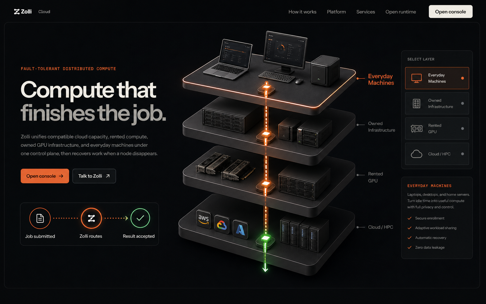
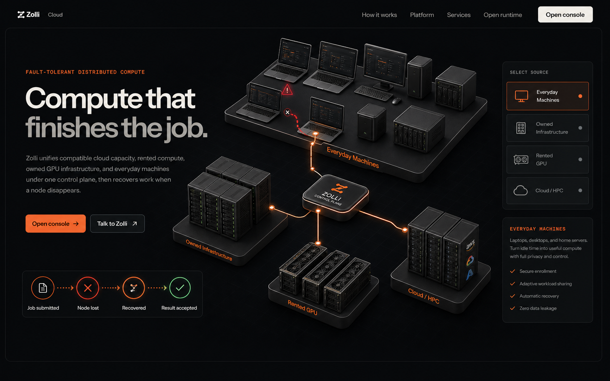
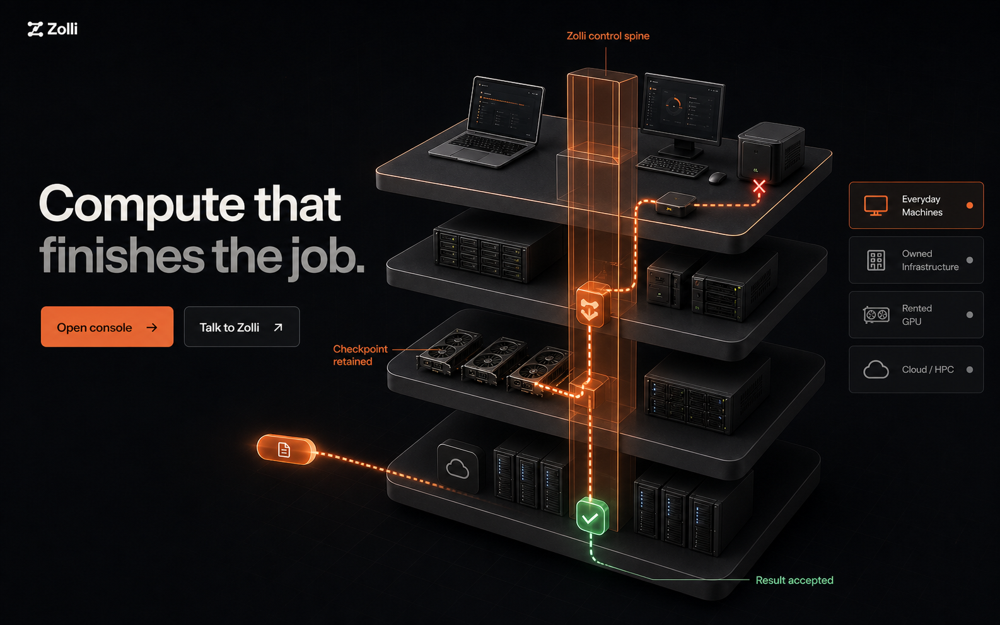
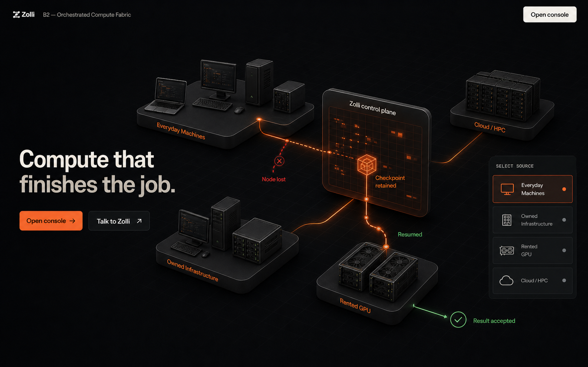
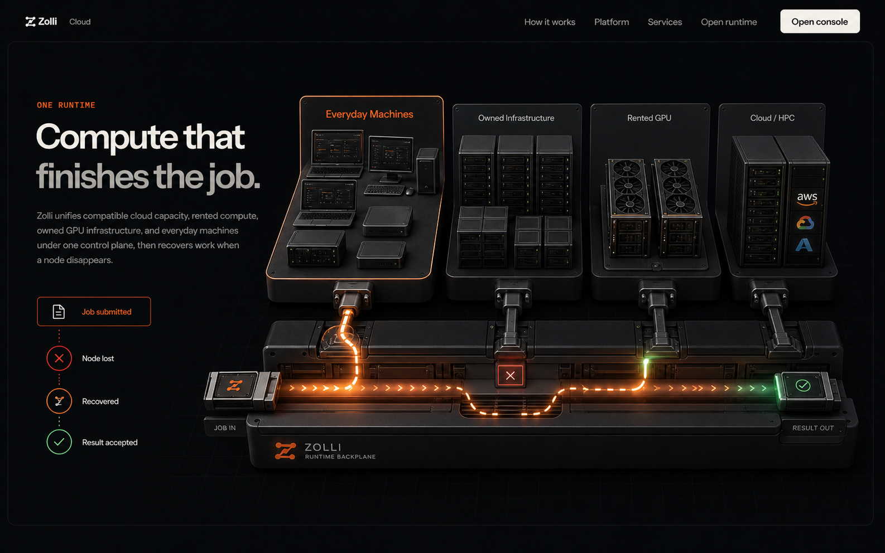

# Zolli 3D Hero References

These full-resolution references were generated during the temporary hero comparison. They remain visual references and are not loaded by the production website.

## Variant A — Exploded Compute Stack

Four thick compute decks—Cloud/HPC, Rented GPU, Owned Infrastructure, and Everyday Machines—connected by one Zolli control spine.

[Open the full-resolution Variant A PNG](./variant-a-exploded-compute-stack.png)



## Variant B — Distributed Compute Topology

Four physically separate compute environments connected through a central Zolli control plane, with a visible failure-and-recovery route.

[Open the full-resolution Variant B PNG](./variant-b-distributed-compute-topology.png)



## Variant A2 — Orchestrated Compute Stack

The selected direction for improving A: the four compute decks stay instantly readable, while a substantial checkpoint-bearing Zolli software-control spine performs the route, failure, resume, and accepted-result story.

[Open the full-resolution Variant A2 PNG](./variant-a2-orchestrated-compute-stack.png)



## Variant B2 — Orchestrated Compute Fabric

The selected direction for improving B: asymmetric compute islands connect through an upright Zolli software-control field that retains the checkpoint and makes the recovery path explicit.

[Open the full-resolution Variant B2 PNG](./variant-b2-orchestrated-compute-fabric.png)



### Production B2 implementation

The approved Option 3 direction is now the production React Three Fiber hero at `/`. Five deterministic, first-party GLBs provide the four device clusters and control-plane chassis; procedural scene components provide the islands, routed job states, checkpoint, node-loss branch, resumed route, and accepted result. The temporary comparison route and the A2/C experiment source were removed after B2 was promoted.

The checked-in assets are generated with `npm run hero:assets` and verified with `npm run hero:assets:validate`. The current five-file set totals 131,360 bytes. Live Three.js inspection exposes named objects including `FabricHeroScene`, `ZolliControlPlane`, all four islands, `CheckpointBeacon`, state-specific `FailureBranch`, and state-specific `AcceptedMarker`.

Measured on the local development machine on 2026-08-10:

- Balanced at 390×844: 62 draw calls, 41,504 triangles, DPR 1, and a 60 FPS average over the measured interval.
- High at 1440×900: 84 authored main-plus-shadow calls and 71,764 triangles. A conservative upper bound including the selective-bloom passes is 106 calls and fewer than 73,000 triangles, at DPR 1 and a 60 FPS average over the measured interval.
- Required limits: Balanced at most 70 calls and 60,000 triangles; High at most 120 calls and 150,000 triangles.
- Twenty exact-viewport screenshots cover submitted, checkpointed, lost, resumed, and accepted at 1440×900, 1280×800, 1024×768, and 390×844. Each was inspected for scene/state agreement, clipping, missing sources, and route readability.
- The original comparison build generated the temporary route; the promoted production build must generate `/` with no `/hero-lab` route.

To view the production hero locally from `apps/web`, load the development environment without printing it and start the web server:

```bash
set -a
source /Users/phongcao/Work/Zolli-Labs/flashml-cloud/.env.dev
set +a
npm run dev -- --hostname 127.0.0.1 --port 3018
```

Then open `http://127.0.0.1:3018/`. The compute fabric appears directly in the landing hero.

## Variant C — Unified Runtime Backplane

Four heterogeneous source bays connected to one substantial execution rail, with a job entering once and exiting as one accepted result.

[Open the full-resolution Variant C PNG](./variant-c-unified-runtime-backplane.png)



## Generation notes

- Mode: Codex built-in image generation
- Use case: UI mockup / hero art-direction reference
- Shared direction: premium dark infrastructure site, warm cream type, Zolli orange orchestration, verified green outcome, upright labels outside the 3D scene, and no transparent-sheet pileup
- Prompt set: exploded compute stack; distributed compute topology; unified runtime backplane; orchestrated compute stack; orchestrated compute fabric
