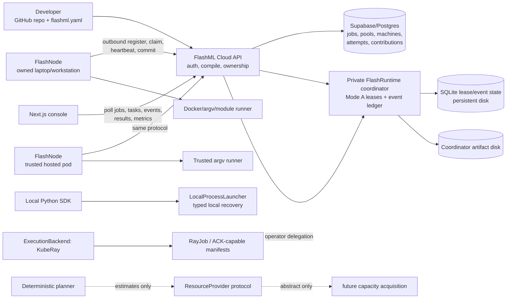

# FlashML Alibaba Competition Demo Implementation Plan

> **For agentic workers:** REQUIRED SUB-SKILL: Use superpowers:subagent-driven-development (recommended) or superpowers:executing-plans to implement this plan task-by-task. Steps use checkbox (`- [ ]`) syntax for tracking.

**Goal:** Submit a technically honest, live FlashML demo to the Beta × Alibaba Cloud × AMD AI Agent Builder Challenge by August 15, 2026 that proves an ML evaluation environment can execute, wait, deep-hibernate, wake on a training artifact event, and continue inside FC Agent Sandbox, while FlashRuntime independently proves lease-based worker failure recovery.

**Architecture:** Keep FlashRuntime's existing pull-based lease engine as the ML job control plane. Prewarm one Alibaba FC Agent Sandbox as a constrained, pool-scoped FlashNode; hibernate it while an existing FlashML worker pool trains and checkpoints; when the training artifact is committed, submit an evaluation task to the sandbox-only pool and resume the same sandbox. A small private-cloud lifecycle controller owns FC create/connect/pause/kill, persists observed lifecycle evidence, mints a one-session machine credential, and revokes it during cleanup. Do not force FC Sandbox into the current `ResourceProvider` interface and do not add a general workflow engine for the deadline.

**Tech Stack:** Python 3.10+, FlashRuntime 0.5.0, FlashNode 0.3.5, FastAPI, PostgreSQL/Supabase, exact-pinned E2B Python SDK, Alibaba FC Agent Sandbox, optional OSS/SLS extensions, Next.js 16, React 19, Vitest, pytest.

**Decision:** The competition demo is **Train → hibernated evaluation worker → artifact event → wake → evaluate**, not provider migration. FlashML's durable thesis is **reliable, measurable ML work over fragmented compute supply**. Cross-provider acquisition, price-aware scheduling, and provider migration remain roadmap claims until they exist.

## Global Constraints

- Current source is the truth. Documentation claims are accepted only when a code path and test support them.
- Do not modify the user's in-progress dataset work in `flashml_cloud_api/compile.py`, `flashml_cloud_api/flashml_yaml.py`, `flashnode/agent/cli.py`, `flashnode/executor/loop.py`, or their new dataset tests unless the owner explicitly rebases this plan onto that work.
- Re-run `git status --short` immediately before implementation. At plan handoff, additional user-owned edits were active in `flashml_cloud_api/app.py`, `flashml_cloud_api/db.py`, `docs/guides/writing-flashml-yaml.md`, `flashnode/executor/datasets.py`, `flashnode/inventory/capabilities.py`, `flashnode/pyproject.toml`, their dataset/capability tests, and the companion dataset plan. Tasks below that name `app.py`, `db.py`, or public FlashNode files must wait for those edits to be committed/rebased and then be applied surgically; never restore or overwrite them.
- No WAN DDP claim. Current PyTorch launch support is single-node only; FSDP/ZeRO appear in planning recommendations, not in a proven multi-node execution path.
- No cross-provider migration claim. The demo contains cross-node retry inside the existing FlashNode pool and a separate Alibaba evaluation phase.
- No raw Alibaba API key, machine token, Supabase secret, or coordinator operator token in a Git repository, image/template, browser response, event payload, task environment, or log.
- FC pause/resume is a P0 external dependency because Alibaba currently documents it as allowlist-gated. If the account cannot pause and reconnect, do not simulate it.
- Call the lifecycle state “deep hibernation” only if the enabled account plan/API observation proves that mode. The E2B-compatible `pause()` call alone proves a paused/hibernated sandbox, not which billing tier was applied.
- Alibaba lifecycle state must be observed from the API and persisted as evidence. Never infer `HIBERNATED`, `ACTIVE`, or `DESTROYED` from an intended call alone.
- Every sandbox is killed in `finally`; every session machine credential is revoked whether the run succeeds or fails.
- Use a dedicated pool containing only the FC sandbox machine. No public task may claim that machine, and no sandbox evaluation task may escape to another host.
- For the deadline, `--runner trusted` means “no nested FlashNode container”; the isolation boundary is the FC Sandbox. The job child receives FlashNode's existing environment allowlist, not the controller's credentials. Record this limitation plainly.
- OSS and SLS are scoring multipliers, not prerequisites for the first complete loop. The existing coordinator artifact path remains the P1 fallback.
- Do not add Qwen, a chatbot, a generic agent loop, multi-cloud logos, or an unneeded Alibaba service.
- Do not imply AMD/ROCm execution from the event sponsorship. Current FlashNode GPU discovery is NVIDIA-`nvidia-smi`-oriented; add an AMD claim only after a real ROCm machine completes the same workload and evidence path.
- The new plan document is the only change authorized in this phase. No implementation begins until this direction is accepted.

---

## 1. Current FlashML architecture from code

### 1.1 Runtime map



The local SDK, KubeRay backend, and lease-based cloud path are real but separate execution paths. The current managed product uses the lease path. The provider/planner packages are not connected to managed provisioning.

### 1.2 Component inventory

| Area | Current implementation | Status | Evidence / boundary |
|---|---|---|---|
| Public wire protocol | `flashruntime/protocol/v1alpha1.py` defines jobs, tasks, leases, attempts, checkpoints, evidence, node capabilities, and events | Working | Versioned Pydantic models; execution backend is only `ray` or `leases` |
| Lease coordinator | `flashruntime/leases/manager.py`, `sqlite_store.py` | Working | Pull claim, heartbeat, expiry, requeue, attempt cap, first-valid-commit wins |
| Task expansion | `flashruntime/service/modea.py`, `recipes/command.py` | Working | Command tasks, HPO, sharded KMeans, federated averaging |
| Placement | `flashruntime/scheduler/__init__.py` | Working but narrow | Fail-closed capability, pool, GPU count, local-data, dependencies, dataset capacity, and exclusions; optional reliability reorder |
| FlashNode loop | `flashnode/executor/loop.py`, `client.py` | Working | Register → claim → stage → execute with heartbeats/checkpoint relay → upload → commit |
| Host runners | `runner.py`, `docker_runner.py`, `argv_runner.py`, `trusted_runner.py` | Working | Docker tiers harden Linux containers; trusted tier is explicitly pool-scoped and host-exec |
| Checkpoints | `flashruntime/checkpoint/*`, service checkpoint routes, FlashNode relay | Working for declared paths | Parts-first, manifest-last, hashes, latest-valid restore; Mode A generic relay currently ships `out/ckpt/step-*.json` |
| Local recovery | `flashruntime/sdk.py`, recovery policy modules | Working locally | Typed failure classification/decision controls local attempts |
| Managed recovery | lease expiry/fail/requeue | Working, less expressive | Managed path does not yet invoke the full typed recovery decision engine |
| PyTorch | `flashruntime/integrations/pytorch.py`, `flashruntime/torch` | Partial | Real `torchrun`/DDP adapter for `nnodes=1`; multi-node raises `NotImplementedError`; no executed FSDP backend |
| HPO | sklearn integration and lease task expansion | Working | Independent trials map naturally to heterogeneous nodes |
| Hugging Face | Trainer callback/resume integration | Working locally | Useful checkpoint integration; not a provider migration system |
| KubeRay | `flashruntime/backends/base.py`, `kuberay.py` | Implemented, not current managed path | Whole-job `ExecutionBackend`; ACK deployment materials exist but are not live production proof |
| Provider abstraction | `flashruntime/providers/__init__.py` | Interface only | `healthy/offers/acquire/release`; no production provider adapter registered |
| RunPod | benchmark scripts and real GPU E2E harness | Experimental evidence | Can query/create/SSH/delete in harness; not a `ResourceProvider` used by cloud scheduling |
| Colab | onboarding/docs and trusted-runner fit | Manual | No programmatic acquisition API or provider adapter |
| Alibaba | OSS artifact implementation, KubeRay/ACK profiles, archived infra | Partial/archived | No current FC Sandbox, Function Compute, ECS, ECI, or PAI integration; current production is Render + Supabase |
| Cloud API | `flashml_cloud_api/app.py`, `db.py`, `compile.py` | Working | Supabase JWTs, machine tokens, pools, GitHub repo submission, coordinator delegation |
| Persistence | Postgres metadata plus coordinator SQLite/artifact disk | Working but split | Cloud records jobs/attempts/contributions; coordinator remains live lease/event source of truth |
| Console | job list/detail, tasks, attempts, swimlanes, topology, results, metrics | Working | UI polls HTTP event/task endpoints; it is not currently an end-to-end SSE stream |
| Metrics | `flashml_cloud_api/metrics.py`, web metrics page | Partial | Attempted/accepted work and goodput exist; MTTD/MTTR are null because terminal failure timing is not fully persisted |
| Auth/security | browser JWT, hashed machine tokens, delegated operator calls, pool stamping | Working | Workloads never receive coordinator operator token; task write scope is lease-limited |
| Test evidence | runtime, node, cloud API, web | Strong | Aug 11 audit: runtime 1,178 passed; node 567 passed; cloud API 1,191 passed; web 341 passed. Skips/deselections/one expected xfail remain |

### 1.3 What the scheduler does and does not do

`IsolationAwarePlacement` answers: “May this asking node run this task?” It does not choose a node, query capacity markets, or acquire a provider. `ReliabilityAwarePlacement` can reorder risky tasks using historical acceptance/failure evidence, but in a pull system it still chooses a task for the node that asked. Therefore “price-aware provider selection” needs a capacity controller plus offer data; it is not a small scoring-function change.

### 1.4 Workload boundary

FlashML's strongest current cross-machine workloads are independent or loosely coupled: command shards, HPO trials, evaluation suites, preprocessing, batch inference, benchmarks, and federated rounds. A tightly coupled job should run within one low-latency provider/cluster. Long term FlashRuntime may choose and recreate that cluster from a portable checkpoint, but the repository does not yet prove this.

---

## 2. What FlashML actually does well today

### 2.1 Converts spare machines into accepted ML work

- **Pain:** teams have usable CPUs/GPUs scattered across laptops, workstations, pods, and temporary environments, but using them requires bespoke setup.
- **Mechanism:** one outbound-only FlashNode protocol, capability registration, pool scoping, pull claims, artifact staging, execution contracts, and exactly-once acceptance.
- **Economic value:** an already-owned machine can replace a rented task-hour when its marginal energy and coordination cost are lower than the rental price.
- **Proof:** current pools, machine enrollment, command/HPO task expansion, runners, contribution ledger, and passing tests.
- **Missing:** automatic discovery/provisioning of rented capacity and measured marginal energy price.

### 2.2 Turns unreliable capacity into reliable useful throughput

- **Pain:** volunteer, spot, notebook, and temporary machines disappear; cheap hourly price is irrelevant if failures erase work.
- **Mechanism:** lease heartbeats, expiry, requeue, attempt caps, checkpoint relay, hash-verified manifests, cross-node restore, first-valid-commit acceptance, and worker self-quarantine.
- **Economic value:** FlashML can lower expected recomputation and make discounted/preemptible capacity usable when checkpoint plus recovery overhead is smaller than the on-demand premium.
- **Proof:** real worker-kill/checkpoint behavior, task recovery paths, lost-lease discard, and extensive tests.
- **Missing:** provider interruption-rate ingestion, automatic provider replacement, and complete managed-path MTTD/MTTR accounting.

### 2.3 Preserves one logical ML job above worker churn

- **Pain:** every execution venue otherwise has different job IDs, logs, retries, and result conventions.
- **Mechanism:** FlashRuntime's job/task/attempt model, append-only events, portable artifact URIs, output validation, and cloud job UI.
- **Economic value:** engineers spend less time manually restarting and reconciling partial runs; accepted output is not double-counted.
- **Proof:** task/attempt timelines, results, evidence, checkpoints, and job state derived from task state.
- **Missing:** a globally durable workflow graph and proven whole-job continuity between provider control planes.

### 2.4 Understands ML work rather than merely executing arbitrary code

- **Pain:** a generic sandbox cannot tell a valid model result from a process exit, quantify lost training work, or map trials/checkpoints to an ML job.
- **Mechanism:** HPO and federated task expansion, checkpoint policies, semantic output validators, metrics commits, GPU capability placement, DDP/HF adapters, and accepted-versus-attempted goodput.
- **Economic value:** spending is tied to accepted work and recoverable progress, not “container was alive.”
- **Proof:** recipes, validators, evidence, checkpoint catalog, and integrations.
- **Missing:** model-quality-aware scheduling and broad framework-neutral checkpoint portability.

---

## 3. Current weaknesses / missing pieces

1. **No production capacity provider.** `ResourceProvider` is an ABC; RunPod logic is a benchmark harness. FlashML does not yet rent, release, or scale machines for a user.
2. **No live economic scheduler.** The planner estimates feasibility/cost from supplied data, but no service fetches prices, transfer cost, capacity, or interruption likelihood.
3. **No cross-provider migration.** No controller snapshots a logical job, acquires another provider, transfers all required state, recreates topology, and resumes it.
4. **Checkpoint portability is workload-specific.** The catalog is sound, but the generic managed relay is JSON-oriented and a framework still must write/read a compatible checkpoint.
5. **Tightly coupled training is narrow.** Proven PyTorch DDP is single-node; WAN DDP and multi-node orchestration are absent. FSDP/ZeRO are planning recommendations, not an execution proof.
6. **Managed recovery is implicit.** Lease retry works, but the richer typed failure taxonomy/decision engine is not wired through the managed service path.
7. **State is split.** Postgres owns product metadata while the coordinator's SQLite/disk owns live attempts, events, and artifacts. That complicates failover and historical metrics.
8. **Observability has holes.** The console is useful, but events are polled, lifecycle metrics are incomplete, and MTTD/MTTR cannot yet be derived reliably.
9. **Artifact storage is not currently cloud-portable.** Native OSS support exists in the public runtime, but the managed product stores artifacts on coordinator disk.
10. **No FC lifecycle integration.** No SDK dependency, credentials, template, hibernation test, durable sandbox record, or cleanup reconciler exists today.
11. **Trusted runner semantics need a durable outer-sandbox contract.** It is appropriate for hosted pods without nested Docker, but the wire model calls it unsandboxed. A production FC worker deserves an explicit platform-isolated runner capability after the competition.
12. **The product thesis can outrun proof.** “One runtime over every cloud” and “move jobs when prices change” are directions, not current user-facing features.
13. **AMD GPU support is not currently proven.** GPU discovery uses `nvidia-smi`, and the existing GPU E2E evidence is CUDA/NVIDIA. Vendor-neutral GPU inventory, ROCm images, and framework validation remain work.

---

## 4. Revised core product thesis

### Positioning

> **FlashML is a reliability and economic control plane for ML work over fragmented compute supply. It turns owned, rented, temporary, and eventually serverless capacity into measurable accepted work, while preserving the logical job when individual workers disappear.**

This is stronger than “use all compute” because it names the supply problem, the unit of value, and the reliability mechanism. It is narrower and more credible than “multi-cloud distributed training.”

### The four reasons to use it

1. **Use sunk or low-marginal-cost capacity first.** Bring existing machines into one outbound-only pool and consume them for suitable tasks.
2. **Use cheaper unreliable capacity without gambling the job.** Checkpoint, retry, replace, and measure accepted goodput.
3. **Keep one operational view across heterogeneous workers.** One job/task/attempt history and one result contract instead of separate provider consoles.
4. **Run ML-shaped work, not generic shell sessions.** Trials, checkpoints, metrics, GPU requirements, validators, and failure evidence are first-class.

### Claim ladder

- **Claim now:** “One lease runtime across user-owned and manually attached heterogeneous machines for independent ML tasks.”
- **Claim after this demo:** “FC Agent Sandbox can join as a stateful, hibernatable evaluation worker, while FlashRuntime preserves the ML job and its evidence.”
- **Claim after provider adapters:** “FlashML can acquire and release heterogeneous capacity.”
- **Claim after a measured optimizer:** “FlashML chooses capacity using effective cost and completion risk.”
- **Claim only after an end-to-end migration test:** “FlashML resumes a provider-bound training job on another provider.”

---

## 5. Economic / money thesis

### 5.1 The correct unit is not hourly list price

For a candidate placement `p`, measure:

```text
expected_cost(p) =
    compute_charge
  + owned_energy_and_wear
  + data_ingress_and_egress
  + artifact_and_checkpoint_storage
  + environment_setup
  + paid_idle_or_wait_time
  + P(interruption) * expected_recompute_loss
  + expected_recovery_and_migration_overhead

effective_cost_per_accepted_task(p) =
    expected_cost(p) / P(valid output accepted before deadline)
```

For a whole job, report cost per accepted task, cost per successful job, wall-clock time, and goodput (`accepted / attempted`). An inexpensive worker with repeated invalid attempts can be more expensive than a reliable premium worker.

### 5.2 How money is actually saved

- **Owned-capacity substitution:** each suitable task-hour run on an already-owned GPU avoids one rented task-hour, net of power, wear/opportunity cost, and longer runtime.
- **Burst instead of permanent rental:** rent only the deficit above owned capacity and only during the queue peak.
- **Interruption arbitrage:** accept spot/preemptible discounts when expected checkpoint/recovery cost is below the on-demand premium.
- **Idle avoidance:** hibernate a prepared evaluation sandbox while it has no checkpoint to evaluate; pay the applicable hibernated-state storage charge instead of active CPU/memory.
- **Capacity-scarcity avoidance:** when one venue has no inventory, choose another instead of leaving an expensive pipeline idle. This needs future live offer adapters.
- **Engineering-time reduction:** automatic retry and unified evidence reduce manual recovery time. Keep this separate from infrastructure-dollar savings.

### 5.3 Long-term scheduler objective

Use a constrained objective rather than “cheapest wins”:

```text
minimize  expected_cost_per_accepted_task
subject to:
  P(complete by deadline) >= target
  memory/GPU/data/isolation requirements satisfied
  transfer time <= budget
  checkpoint format compatible
  provider and pool policy satisfied
```

Add a user-adjustable time penalty only after costs are measured: `score = expected_cost + lambda * expected_completion_time + risk_penalty`. Do not build this optimizer for the competition; build its evidence inputs.

---

## 6. Alibaba services mapped to FlashML

| Alibaba option | Correct FlashML role | Fit now | Demo difficulty | Competition impact | Long-term value | Duplication risk | Decision |
|---|---|---:|---:|---:|---:|---:|---|
| **E. FC Agent Sandbox** | Stateful isolated execution session; for deadline, hosts a pool-scoped FlashNode plus prepared evaluation environment | High with lifecycle wrapper | Medium, allowlist-dependent | Highest | High for evaluation, benchmarks, untrusted/user code, phase waits | Low if FlashRuntime owns ML state and FC owns isolation/session | **P0/P1 centerpiece** |
| **B. ECS** | VM capacity acquired by a future provider adapter, then runs ordinary FlashNode | Architecturally clean | Medium | Low alone | High | Low | Post-deadline provider MVP |
| **C. ECI** | Ephemeral container capacity that boots one FlashNode or one-shot task worker | Good for independent jobs | Medium/high due networking/image/auth | Medium | High for burst and spot | Moderate; ECI already handles container lifecycle | P3 after ECS/FC proof |
| **A. Function Compute async tasks** | Whole-task execution backend for bounded CPU/GPU preprocessing/evaluation, not a “machine provider” | Requires new backend semantics | Medium/high | Medium | Medium | Moderate; FC already schedules/retries functions | Do not build now |
| **D. PAI-DLC + AIMaster** | Managed whole-job backend for one tightly coupled single/multi-node training job | Fits `ExecutionBackend` better than `ResourceProvider` | High | Low for FC Sandbox rubric | High for Alibaba-local distributed training | High if FlashML reimplements AIMaster fault tolerance | Future backend; delegate cluster health to PAI |
| **OSS** | Durable artifacts/checkpoints shared across sandbox lifecycles/providers | Public runtime support exists; cloud path not wired | Medium | Medium/high | High | Low | P2, current artifact API fallback |
| **SLS / CloudMonitor** | Independent source for sandbox logs, state, alerts, and resource metrics | Cloud-side extension/setup | Medium | High | Medium/high | Low | P2 if extension enabled |

Architectural distinction:

- `ResourceProvider` acquires/releases machines. ECS and possibly ECI fit this family.
- `ExecutionBackend` accepts a whole `JobSpec`. KubeRay and PAI-DLC fit this family.
- FC Agent Sandbox is a **stateful execution session**. For the deadline, hosting FlashNode inside it reuses the existing worker contract without prematurely designing a third general abstraction.

Alibaba already keeps an Alibaba-local DLC job healthy through AIMaster. FlashML's defensible future layer is choosing the venue, preserving provider-neutral job identity/artifacts, and coordinating recovery beyond one provider. That cross-provider layer is not yet implemented and must be labeled roadmap.

Current Alibaba documentation also constrains the plan:

- [FC Agent Sandbox E2B compatibility](https://www.alibabacloud.com/help/en/functioncompute/e2b-compatibility-description) says create/connect/inspect/pause/kill are compatible, but pause/resume requires allowlist access; SDK logs are limited and metrics are one-minute CPU/memory observations.
- [Hibernation and Resume](https://www.alibabacloud.com/help/en/functioncompute/hibernation-and-recovery) describes active, light, and deep hibernation, with deep resume around the one-second level subject to real workload conditions.
- [Sandbox billing](https://www.alibabacloud.com/help/en/functioncompute/pay-as-you-go-of-fc-agent-sandbox) is still invite-only preview; deep hibernation stops vCPU/memory charges but retains billable disk state, and plan/region availability can change.
- [FC Extensions](https://www.alibabacloud.com/help/en/functioncompute/fc-extensions-overview) puts OSS mounts, SLS logging, VPC, and monitoring in cloud-side configuration rather than the E2B SDK.
- [PAI-DLC/AIMaster](https://www.alibabacloud.com/help/en/pai/aimaster-elastic-fault-tolerant-engine) already provides job-level monitoring and fault tolerance for supported Alibaba-local distributed frameworks.

---

## 7. What NOT to build

1. A chatbot, Qwen wrapper, or fictional “agent” persona.
2. WAN DDP across home, RunPod, and Alibaba.
3. A general DAG/workflow engine. The demo needs one explicit train-to-evaluate dependency.
4. A general multi-cloud provider marketplace or optimizer before one production provider adapter exists.
5. Cross-provider training migration in four days.
6. New fault-tolerance machinery inside PAI-DLC; AIMaster already owns Alibaba-local cluster health.
7. Function Compute, ECS, ECI, PAI, OSS, SLS, and FC Sandbox integrations simultaneously.
8. A redesign of the whole dashboard or a migration from polling to SSE.
9. A public-protocol backend named `fc-sandbox` for the deadline. The existing lease worker path is smaller and better proven.
10. A custom sandbox/VM isolation layer inside FlashNode. FC Sandbox is the outer boundary.
11. Live-price claims based on scraped marketing pages. Store captured quotes with region, SKU, currency, and timestamp when the optimizer work begins.
12. “Free owned compute.” Owned hardware has power, wear, and opportunity cost; call it sunk or low marginal cost only after measurement.
13. A last-minute ROCm port merely because AMD co-hosts the program. If actual AMD hardware and mentor support are available, run a bounded compatibility spike; otherwise keep the submission technically honest.

---

## 8. Candidate competition demos

### Candidate A — Train → wait → hibernate → evaluate

Train on the existing FlashNode pool. An FC Sandbox prepares an evaluation environment, starts an idle FlashNode, and deep-hibernates. A committed model artifact is the external event. The same sandbox wakes, preserves its marker/process identity, claims a pool-scoped evaluation job, and emits metrics. Independently kill one training worker and show checkpoint recovery on another node.

- Strongest natural hibernation story.
- Uses Alibaba for real ML compute and stateful environment reuse.
- Keeps FlashRuntime central through jobs, leases, checkpoints, artifacts, and evidence.
- Avoids false provider migration.

### Candidate B — Isolated third-party model benchmark gate

A user submits a model repository. FC Sandbox prepares and validates it, hibernates while waiting for dataset-owner approval or a model artifact, then resumes the same isolated environment to benchmark. FlashRuntime schedules benchmark shards and validates outputs.

- Strong isolation/security narrative and natural human wait.
- Less differentiated from generic code-evaluation entries.
- Adds approval/product UX not present today.

### Candidate C — HPO burst fabric

Submit many independent HPO trials across owned FlashNodes and multiple FC sandboxes. Hibernate unused prepared sandboxes between waves; wake when the queue exceeds owned capacity; reassign a failed trial.

- Excellent long-term workload fit and economic story.
- Requires capacity scaling and queue policy that do not exist.
- Hibernation is less natural if a sandbox can simply be destroyed and recreated.

### Candidate D — RunPod failure → Alibaba resume

Train on RunPod, interrupt it, preserve a checkpoint, provision Alibaba capacity, and resume.

- Most dramatic portability story.
- Current production adapters, checkpoint transfer, cluster recreation, and cross-provider orchestration do not exist.
- FC Sandbox would be bolted on unless the resumed workload itself runs there.
- Too risky and likely to overclaim.

---

## 9. Scoring matrix against the 10 judging dimensions

Scale: 1 weak, 3 adequate, 5 exceptional. “Total” is directional; feasibility is reflected in each score rather than applied as a hidden multiplier.

| Candidate | Scenario value | First success UX | FC stability | Observability | Extensibility | FC core proof | Security | Full lifecycle loop | Cost awareness | Continuity/reuse | Total / 50 |
|---|---:|---:|---:|---:|---:|---:|---:|---:|---:|---:|---:|
| A. Train → hibernate → evaluate | 5 | 4 | 5 | 5 | 4 | 5 | 4 | 5 | 5 | 5 | **47** |
| B. Third-party benchmark gate | 4 | 4 | 5 | 5 | 4 | 5 | 5 | 5 | 4 | 5 | **46** |
| C. HPO burst fabric | 5 | 3 | 3 | 4 | 5 | 3 | 4 | 3 | 5 | 4 | **39** |
| D. Cross-provider resume | 5 | 2 | 2 | 4 | 5 | 2 | 3 | 2 | 5 | 5 | **35** |

Candidate A wins because it simultaneously has a natural external wait, a visible state-preservation test, genuine ML work, and a credible implementation path from current code. Candidate B is the fallback product scenario if training recovery becomes unstable; it uses the same FC lifecycle slice.

---

## 10. Recommended demo

### Demo name

**FlashML Checkpoint Gate: train anywhere, wake the prepared evaluator only when the model is ready.**

### Live sequence

1. Submit a small deterministic PyTorch training job to a two-machine FlashML pool. It writes `out/ckpt/step-*.json`, a final `model.json`/`model.pt`, and root `metrics.json`.
2. In parallel, the control plane creates an FC Agent Sandbox from a pinned evaluation template.
3. Inside FC, execute a preparation probe, write `/home/flashml/prepared.json` with template version and nonce, create the one-session FlashNode identity, and start `flashnode work --runner trusted --max-tasks 1` against a dedicated pool.
4. Show the sandbox active and the worker idle because no evaluation task exists.
5. Deep-hibernate it. Persist observed sandbox ID, API state, marker hash, process identity, pause latency, and timestamp.
6. During training, deliberately terminate one training worker process/container after a checkpoint commit. The lease expires, a second node claims the same task, downloads the latest valid checkpoint, and continues.
7. The committed final model artifact is the external event. The orchestrator submits one evaluation task whose `inputs` include the model artifact URI and whose placement pool contains only the FC worker.
8. Resume by reconnecting to the same sandbox ID. Verify the same marker and background FlashNode process survive, record wake latency, and observe the worker re-register/heartbeat if needed.
9. The FC worker claims and evaluates the model, writes accuracy/latency plus root `metrics.json`, and commits accepted output.
10. Show one combined timeline: sandbox prepare → wait → deep hibernate → model ready → resume → evaluation attempt accepted, plus the separate training retry/checkpoint evidence.
11. Kill the sandbox and revoke its machine credential. Show the observed destroyed state and zero live demo sandboxes.

### Why hibernation is real, not decorative

The evaluation environment represents dependencies, benchmark tooling, and cached dataset/model setup that is expensive to rebuild. It is prepared while training is in progress, consumes no active CPU/memory during a long wait under the documented deep-hibernation billing model, and resumes the same environment immediately when a model is ready. The demo measures whether this is actually cheaper/faster than destroy-and-recreate.

### Honest boundary

The demo does **not** migrate the training job to Alibaba. It proves two composable capabilities:

- FlashRuntime preserves a training task across a worker loss.
- Alibaba preserves a prepared evaluation execution session across an idle gap.

The combined workflow is the product insight: ML pipelines need both job-level progress durability and phase-specific execution economics.

---

## 11. Recommended Alibaba architecture

```mermaid
sequenceDiagram
    participant O as Demo orchestrator
    participant C as FlashML Cloud API
    participant R as FlashRuntime lease coordinator
    participant T as Training FlashNodes
    participant F as FC Agent Sandbox
    participant E as FC-hosted FlashNode

    O->>C: create sandbox-evaluation session
    C->>F: Sandbox.create(pinned template)
    F-->>C: sandboxId + ACTIVE
    C->>C: mint one-session machine token; add to sandbox-only pool
    C->>F: write credential file (0600), start FlashNode, verify marker
    F->>E: FlashNode process starts
    E->>C: register + heartbeat + empty claim
    C->>F: pause/deep-hibernate
    F-->>C: observed HIBERNATED

    O->>C: submit training job
    C->>R: JobSpec(leases)
    T->>R: claim + checkpoint
    Note over T,R: kill worker; lease expires; another node restores
    T->>R: final model artifact + accepted commit

    O->>C: external event: model artifact ready
    C->>R: submit evaluation task to sandbox-only pool
    C->>F: connect/resume(same sandboxId)
    F-->>C: observed ACTIVE + marker intact
    E->>R: heartbeat/register, claim evaluation
    E->>R: accepted evaluation metrics
    C->>F: kill
    C->>C: revoke machine token, record DESTROYED
```

### Boundary ownership

| Concern | Owner |
|---|---|
| Logical ML job/task/attempt, checkpoint, artifact validity | FlashRuntime |
| User/pool authorization, machine identity, lifecycle evidence | FlashML Cloud API |
| Isolated process/filesystem session, hibernate/resume, sandbox metrics | Alibaba FC Agent Sandbox |
| Long-lived artifact portability | Existing coordinator in P1; OSS in P2 |
| Cloud-native logs/alerts | App evidence in P1; SLS/CloudMonitor in P2 |

### Why not a new `ExecutionBackend` now

`ExecutionBackend` submits a whole `JobRecord` to a backend such as KubeRay. The demo needs an FC session to wait and then participate in the existing lease system. Hosting FlashNode inside FC reuses task placement, auth, heartbeat, checkpoint, artifact, and result semantics. After the deadline, repeated use should inform whether FC becomes a first-class session executor rather than prematurely freezing the wrong public interface.

---

## 12. Differentiation vs SeaWeb / Verity / LoopChat / Firassa

| Competitor pattern | Their likely strength | FlashML response |
|---|---|---|
| SeaWeb | Broad rubric coverage, Alibaba services, polished agent execution | Do not match logo count. Show one ML pipeline where FC lifecycle and FlashRuntime recovery solve different layers, with accepted-work economics |
| Verity | Public, explicit create/exec/hibernate/wake/kill, timings, fallback | Match the lifecycle rigor and cleanup evidence; differentiate with leased ML task execution, checkpoint recovery, output validation, and job/attempt history |
| LoopChat | Exceptionally natural human wait/approval story | Use an equally natural machine event: no model exists to evaluate until training commits it. Measure active idle time avoided |
| Firassa | Wide Alibaba stack and observability | Keep scope narrow; add OSS/SLS only if they strengthen durable artifact/log proof, not as badges |

What FlashML can demonstrate that a generic sandbox application usually cannot:

1. The same logical ML task survives a real worker death through lease expiry and checkpoint restore.
2. Attempted work and accepted work are distinct, with exactly-once result acceptance.
3. A pool can contain owned machines and a stateful Alibaba execution environment under one worker protocol.
4. Scheduling is constrained by GPU, data, dependencies, isolation, pool membership, and health evidence.
5. The money story is measured as useful completed work per dollar, not simply “serverless scales.”

Do not claim competitors lack these properties unless their public submission is audited. Phrase differentiation as what this demo proves.

---

## 13. P0/P1/P2/P3 implementation plan

### P0 — Competition blockers

#### Task 0: Prove FC Agent Sandbox lifecycle on the actual account before integration

**Repository/package:** `flashml-cloud`, standalone competition evidence script

**Files:**

- Create: `flashml-cloud/scripts/competition/alibaba_fc_sandbox_smoke.py`
- Create: `flashml-cloud/scripts/competition/README.md`
- Create locally, gitignored: `flashml-cloud/.evidence/alibaba-sandbox-smoke-<timestamp>.json`
- Modify: `flashml-cloud/.gitignore` only if `.evidence/` is not already ignored

**Interface:**

```python
@dataclass(frozen=True)
class SandboxSmokeEvidence:
    region: str
    sdk_version: str
    template: str
    sandbox_id: str
    create_ms: float
    pause_ms: float
    resume_ms: float
    marker_sha256_before: str
    marker_sha256_after: str
    pid_before: int
    pid_after: int
    final_state: str
    cleanup_verified: bool
```

- [ ] Pin the documented SDK version in a temporary isolated environment; do not yet add it to the API dependency set.
- [ ] Create `code-interpreter-v1` using `E2B_API_KEY`, `E2B_API_URL`, and `E2B_DOMAIN` from the environment.
- [ ] Execute a command, write a random nonce marker, start a long-lived background process, and record its PID.
- [ ] Inspect the sandbox and record the observed active state.
- [ ] Call `pause()`; inspect and record the actual hibernation state/plan. Label it deep only when the account and observation support that label.
- [ ] Wait 30 seconds outside the sandbox; use `Sandbox.connect(sandbox_id)` to resume.
- [ ] Verify marker hash and process identity/state, then run a continuation command.
- [ ] Fetch supported CPU/memory metrics and record their granularity without treating them as billing truth.
- [ ] Kill in `finally`, list/inspect until no live sandbox remains, and write sanitized JSON evidence.
- [ ] Test region/template mismatch and invalid key errors so the runbook names them clearly.

**Success criteria:** One real create → execute → wait → hibernate → connect/resume → continue → kill run; same sandbox ID; state marker preserved; actual latencies captured; cleanup observed; no secret in JSON/stdout.

**Stop condition:** If pause/connect returns the documented allowlist error, stop integration immediately, submit the enablement request with account/region/deadline, and exercise Risk R1. Do not code against a capability the account cannot call.

#### Task 1: Freeze the demo workload and baseline recovery without Alibaba

**Repository/package:** public `flashml` demo/e2e assets only

**Files:**

- Create: `flashml/e2e/competition/train_checkpointed.py`
- Create: `flashml/e2e/competition/evaluate_model.py`
- Create: `flashml/e2e/competition/flashml.train.yaml`
- Create: `flashml/e2e/competition/flashml.evaluate.yaml`
- Create: `flashml/e2e/competition/run_local_recovery.sh`
- Test: `flashml/e2e/competition/test_workloads.py`

**Workload contract:**

- Training is deterministic and takes 45–75 seconds on CPU, longer only if explicitly configured.
- Every epoch writes atomic JSON `out/ckpt/step-<n>.json` containing model state, optimizer/progress state, seed, schema version, and checksum-able data.
- On resume, training reads `/work/inputs/resume.json`, records `resumed_from_step`, and never repeats more than the configured checkpoint interval.
- Final output includes root `metrics.json` plus `model.json` or a small framework-native checkpoint.
- Evaluation consumes a declared `artifact://` model input and writes accuracy, sample count, latency, model hash, and root `metrics.json`.

- [ ] Write unit tests for deterministic uninterrupted output and resume-equivalent output.
- [ ] Run on two current FlashNodes in one pool.
- [ ] Terminate the first node's process group/container after a checkpoint is visibly committed.
- [ ] Verify lease expiry, requeue, second attempt on another node, restore event, final accepted commit, and identical final model hash.
- [ ] Save a sanitized event/metric fixture for the UI and deck.

**Success criteria:** Three consecutive recovery runs finish with the same model hash; each contains a real checkpoint before failure, a different node ID after failure, exactly one accepted task commit, and measured MTTD/recovery/lost-work values.

### P1 — Core live demo

#### Task 2: Add an exact, injectable FC Sandbox client

**Repository/package:** private cloud API

**Files:**

- Modify: `flashml-cloud/apps/api/pyproject.toml` (exact-pin E2B SDK after P0 proves version)
- Modify: `flashml-cloud/apps/api/flashml_cloud_api/settings.py`
- Create: `flashml-cloud/apps/api/flashml_cloud_api/alibaba_sandbox.py`
- Test: `flashml-cloud/apps/api/tests/test_alibaba_sandbox.py`
- Test: `flashml-cloud/apps/api/tests/test_settings.py`

**Interfaces:**

```python
class SandboxGateway(Protocol):
    async def create(self, template: str, metadata: dict[str, str]) -> SandboxObservation: ...
    async def inspect(self, sandbox_id: str) -> SandboxObservation: ...
    async def run(self, sandbox_id: str, argv: list[str], *, timeout_s: int) -> CommandEvidence: ...
    async def write_file(self, sandbox_id: str, path: str, data: bytes) -> None: ...
    async def pause(self, sandbox_id: str) -> SandboxObservation: ...
    async def connect(self, sandbox_id: str) -> SandboxObservation: ...
    async def metrics(self, sandbox_id: str) -> list[SandboxMetric]: ...
    async def kill(self, sandbox_id: str) -> SandboxObservation: ...
```

`Settings` additions: `fc_sandbox_enabled`, `fc_sandbox_api_key`, `fc_sandbox_api_url`, `fc_sandbox_domain`, `fc_sandbox_region`, `fc_sandbox_template`, `fc_sandbox_pool_id`. Configuration is all-or-nothing when enabled and redacted in representations/errors.

- [ ] Write fake-gateway tests for every call, timeout, retryable transport failure, terminal auth/allowlist failure, and idempotent kill.
- [ ] Wrap synchronous SDK calls in `asyncio.to_thread`; enforce explicit timeouts.
- [ ] Convert SDK objects into small typed observations; never persist arbitrary SDK response dictionaries containing secrets.
- [ ] Record latency around observed calls with a monotonic clock.
- [ ] Test that exceptions, dataclass reprs, and app startup logs never contain API key values.

**Success criteria:** All lifecycle behavior can be tested with a fake; the real gateway passes the P0 smoke flow; importing the module with FC disabled does not require credentials or contact Alibaba.

#### Task 3: Persist an append-only sandbox lifecycle ledger

**Repository/package:** private cloud API / Postgres

**Files:**

- Create: `flashml-cloud/apps/api/migrations/0014_sandbox_sessions.sql`
- Modify: `flashml-cloud/apps/api/flashml_cloud_api/db.py`
- Create: `flashml-cloud/apps/api/flashml_cloud_api/sandbox_sessions.py`
- Test: `flashml-cloud/apps/api/tests/test_schema.py`
- Test: `flashml-cloud/apps/api/tests/test_db_sandbox_sessions.py`
- Test: `flashml-cloud/apps/api/tests/test_sandbox_sessions.py`

**Data model:**

```text
sandbox_sessions:
  id uuid PK, owner_id FK, pool_id FK, machine_id FK nullable,
  training_job_id FK, evaluation_job_id FK nullable,
  provider='alibaba-fc-sandbox', region, template,
  external_sandbox_id unique nullable,
  state check(REQUESTED, ACTIVE, PREPARED, HIBERNATED,
              RESUMING, EVALUATING, SUCCEEDED, FAILED, TERMINATED),
  marker_sha256, created_at, updated_at, terminated_at,
  error_code, error_message_sanitized

sandbox_events:
  id bigserial PK, session_id FK, sequence bigint,
  type, source, observed_at, latency_ms, data jsonb,
  unique(session_id, sequence)
```

- [ ] Test owner scoping and RLS before repository functions.
- [ ] Implement compare-and-set state transitions; duplicate retries must not append contradictory transitions.
- [ ] Treat events as observed facts: requested, API response, inspected state, marker verification, external artifact event, cleanup.
- [ ] Store only token prefix/machine ID through existing machine tables; never add a raw token column.
- [ ] Add query functions for session detail, ordered events, and unfinished sessions requiring cleanup.

**Success criteria:** Restarting the API loses no lifecycle evidence; two controllers cannot both transition a session from hibernated to resuming; another user receives 404; no secret-bearing column exists.

#### Task 4: Provision one-session FlashNode identity and sandbox-only pool membership

**Repository/package:** private cloud API auth/database

**Files:**

- Modify: `flashml-cloud/apps/api/flashml_cloud_api/enrolment.py`
- Modify: `flashml-cloud/apps/api/flashml_cloud_api/db.py`
- Modify: `flashml-cloud/apps/api/flashml_cloud_api/sandbox_sessions.py`
- Test: `flashml-cloud/apps/api/tests/test_sandbox_machine_identity.py`
- Test: `flashml-cloud/apps/api/tests/test_pool_visibility.py`

**Interface:**

```python
@dataclass(frozen=True)
class EphemeralMachineCredential:
    machine_id: str
    node_id: str
    raw_token: str  # returned once, controller-memory only

def provision_ephemeral_machine(
    db, *, owner_id: str, pool_id: str, node_id: str, label: str
) -> EphemeralMachineCredential: ...
```

- [ ] Reuse `new_machine_token`, `hash_machine_token`, machine rows, and pool-membership stamping; do not invent a second credential type.
- [ ] Require the session owner to own/administer the configured dedicated pool.
- [ ] Ensure pool membership contains only the managed sandbox machine during the demo.
- [ ] Write the credential file through the sandbox filesystem API with restrictive mode, start FlashNode, wait for registration, then remove the on-disk credential; the agent keeps its already-loaded token in memory.
- [ ] Verify the job child environment cannot see the machine token or Alibaba controller key.
- [ ] On every terminal path, revoke the machine token and mark the machine revoked before/alongside sandbox kill.

**Success criteria:** A sandbox worker can register, heartbeat, and claim only from its dedicated pool; token is returned once; job code cannot read it; after cleanup all agent calls receive 401 and no other pool can route work to the machine.

#### Task 5: Build and verify the pinned evaluation template

**Repository/package:** private deployment assets

**Files:**

- Create: `flashml-cloud/infra/alibaba/fc-sandbox/evaluation-template.Dockerfile`
- Create: `flashml-cloud/infra/alibaba/fc-sandbox/build_template.py`
- Create: `flashml-cloud/infra/alibaba/fc-sandbox/template.lock.json`
- Create: `flashml-cloud/infra/alibaba/fc-sandbox/README.md`
- Test: `flashml-cloud/apps/api/tests/test_fc_template_lock.py`

**Template contents:** exact Python, FlashNode wheel/version, evaluation dependencies, CA certificates, non-root user where supported, and no credentials. Do not download large dependencies on the live demo path.

- [ ] Lock image digest, template ID/version, SDK version, region, and build timestamp.
- [ ] Add a self-test command for Python imports, disk path, outbound coordinator reachability, and expected FlashNode version.
- [ ] Confirm no Docker daemon is assumed inside FC Sandbox.
- [ ] Confirm the template contains no `.env`, token, API key, cloud credential, or user dataset.
- [ ] Measure cold create+prepare versus resume+verify across at least five runs.

**Success criteria:** Five consecutive sandboxes start from the same template digest; self-test passes; no dependency installation occurs during the 3-minute live path; secrets scan is clean.

#### Task 6: Implement the narrow train-to-evaluation lifecycle controller

**Repository/package:** private cloud API

**Files:**

- Create: `flashml-cloud/apps/api/flashml_cloud_api/sandbox_orchestrator.py`
- Modify: `flashml-cloud/apps/api/flashml_cloud_api/app.py`
- Create: `flashml-cloud/apps/api/tests/test_sandbox_orchestrator.py`
- Create: `flashml-cloud/apps/api/tests/test_sandbox_api.py`
- Create: `flashml-cloud/scripts/competition/run_demo.py`

**Browser API:**

```text
POST /v1alpha1/jobs/{training_job_id}/sandbox-evaluation
  body: { model_artifact_key, evaluation_repo/ref/path }
  -> 201 { session_id }

GET /v1alpha1/sandbox-sessions/{session_id}
GET /v1alpha1/sandbox-sessions/{session_id}/events
POST /v1alpha1/sandbox-sessions/{session_id}/cleanup
```

The orchestration reducer accepts only these facts: sandbox observed active/prepared/hibernated, training artifact observed committed, evaluation job submitted, sandbox observed active after reconnect, evaluation accepted, sandbox observed terminated.

- [ ] Start session: authorize the training job, provision machine, create sandbox, verify template marker, start idle FlashNode, pause, inspect hibernated.
- [ ] External event: poll the existing owner-scoped job/result/artifact APIs from the demo script; when the exact model key and SHA exist, POST the trigger once.
- [ ] Submit an internally constructed lease-mode evaluation `JobSpec` with `inputs = {"code": ..., "model": "artifact://..."}` and placement set to the dedicated pool. Do not widen `flashml.yaml` in the dirty dataset branch.
- [ ] Put the evaluation task in the queue before resume so the hibernated worker has immediate useful work.
- [ ] Connect/resume the same sandbox ID, verify marker hash, and observe the FlashNode heartbeat/register.
- [ ] Wait for accepted evaluation result, then cleanup in `finally`.
- [ ] Make trigger and cleanup idempotent; replay after API restart from persisted session state.
- [ ] Refuse arbitrary template names, commands, pools, artifact owners, or external sandbox IDs from the browser.

**Success criteria:** Three consecutive end-to-end runs complete without manual timing; every run shows the full lifecycle, one external model-artifact event, one accepted evaluation result, and verified cleanup. API restart during hibernation can recover from the stored sandbox ID and continue.

#### Task 7: Add one combined evidence view, not a dashboard redesign

**Repository/package:** private Next.js web

**Files:**

- Modify: `flashml-cloud/apps/web/lib/cloud-api.ts`
- Create: `flashml-cloud/apps/web/lib/sandbox-session.ts`
- Create: `flashml-cloud/apps/web/lib/sandbox-session.test.ts`
- Create: `flashml-cloud/apps/web/components/jobs/SandboxLifecycle.tsx`
- Modify: `flashml-cloud/apps/web/app/(console)/jobs/[jobId]/page.tsx`
- Test: relevant component/page Vitest files

**UI contract:** Display provider badge, observed state, sandbox ID suffix, template digest suffix, lifecycle timeline, create/pause/resume latencies, active/hibernated durations, marker continuity, external trigger, evaluation attempt, cleanup status, and an explicit boundary note: “training retry and sandbox hibernation are separate guarantees.”

- [ ] Write event-normalization tests with out-of-order polling responses and duplicate events.
- [ ] Poll the new endpoint using the existing page pattern; do not introduce SSE for this slice.
- [ ] Never display or fetch secrets, full machine tokens, or controller configuration.
- [ ] Render unavailable metrics as “not observed,” never zero.
- [ ] Add a presenter mode that fits at 1280×720 without hiding lifecycle evidence.

**Success criteria:** A judge can identify execute, wait, hibernate, external event, wake, continue, accepted output, and cleanup on one screen in under 15 seconds.

### P2 — Scoring multipliers

#### Task 8: Complete lifecycle, recovery, and cost evidence

**Files:**

- Modify: `flashml-cloud/apps/api/flashml_cloud_api/metrics.py`
- Modify: `flashml-cloud/apps/api/flashml_cloud_api/db.py`
- Create: `flashml-cloud/apps/api/flashml_cloud_api/cost_model.py`
- Test: `flashml-cloud/apps/api/tests/test_cost_model.py`
- Modify: `flashml-cloud/apps/web/lib/platform-metrics.ts`
- Modify: `flashml-cloud/apps/web/app/(console)/metrics/page.tsx`

- [ ] Persist attempt failure/expiry terminal timestamps so MTTD and MTTR are derived from events rather than left null.
- [ ] Calculate training failure detection, replacement claim, checkpoint restore, lost steps, sandbox active wait avoided, create/resume ratios, and goodput.
- [ ] Store price observations with provider, SKU, region, currency, source URL/bill, captured timestamp, and unit.
- [ ] Report modeled values as estimates and actual Alibaba bills as actuals.

**Success criteria:** Every number shown has an event/source trail and unit; cost arithmetic round-trips in tests; no list price is presented as a bill.

#### Task 9: Add OSS only after the full loop works on coordinator artifacts

**Files:**

- Modify only after branch reconciliation: cloud artifact-store configuration and deployment environment
- Create: `flashml-cloud/apps/api/tests/test_oss_sandbox_artifact_flow.py`
- Create: `flashml-cloud/infra/alibaba/oss/README.md`

- [ ] Use a session/job prefix and least-privilege role or short-lived signed access; no account access key enters a task.
- [ ] Upload model/checkpoint manifest last, verify SHA after sandbox resume, and use OSS as the shared artifact source.
- [ ] If dynamic OSS mounts are not enabled, use the existing native OSS client path or keep the coordinator artifact fallback.

**Success criteria:** Destroying/recreating a sandbox does not lose the model artifact; unauthorized prefixes fail; the demo still works when OSS is disabled.

#### Task 10: Add SLS/CloudMonitor as independent evidence if enabled

**Files:**

- Create: `flashml-cloud/infra/alibaba/observability/README.md`
- Create: `flashml-cloud/scripts/competition/export_sls_evidence.py`
- Test: sanitizer/unit tests around exported evidence

- [ ] Forward sandbox/controller logs through the FC extension rather than E2B `logs`, which Alibaba documents as limited.
- [ ] Correlate on `session_id`, `sandbox_id`, `job_id`, `task_id`, and `lease_id`; never include bearer values.
- [ ] Add alert for sandbox active beyond timeout and cleanup failure.

**Success criteria:** One SLS query reconstructs the lifecycle; one CloudMonitor/cleanup alert can be shown; app continues without the extension.

#### Task 11: Security and elasticity probes

- [ ] Secret-canary job proves the child environment cannot see controller or machine secrets.
- [ ] Pool-escape test proves evaluation cannot claim on a non-FC node and a public job cannot claim the FC node.
- [ ] Path traversal/symlink test for staged model artifacts.
- [ ] Run 5–10 sandboxes only within quota, with bounded concurrency and guaranteed cleanup; report p50/p95 create/resume and failure rate.
- [ ] Confirm supported CPU/memory metrics are observational only and use SLS/CloudMonitor/bills for governance.

### P3 — Durable product work after submission

1. Add an explicit platform-isolated/outer-sandbox runner capability so FC does not rely on the trusted-runner fallback semantic.
2. Implement ECS `ResourceProvider` first: offers, acquire, bootstrap FlashNode, health, release, hard lifetime cap, and spend ceiling.
3. Evaluate ECI as ephemeral FlashNode capacity after ECS clarifies networking/auth/bootstrap contracts.
4. Implement PAI-DLC as a whole-job `ExecutionBackend`, delegating local training fault tolerance to AIMaster.
5. Move managed artifacts/checkpoints to a durable object store and unify historical events in Postgres.
6. Wire typed recovery decisions into managed attempts.
7. Build live price/capacity/interruption observations, then a constrained effective-cost scheduler.
8. Add a provider-migration qualification suite: data locality, checkpoint compatibility, topology recreation, deterministic resume, egress cost, and rollback.
9. Generalize the narrow train/evaluate controller only after two more real phase-wait workflows appear.
10. Add AMD/ROCm support as a real provider capability: `rocm-smi`/runtime inventory, ROCm image catalog, device placement fields, and an actual training/evaluation qualification run before marketing it.

---

## 14. Metrics and experiments

### 14.1 Required metrics

| Metric | Start event | End event | Source | Demo target |
|---|---|---|---|---|
| Sandbox create latency | create request monotonic time | observed ACTIVE | controller + FC inspect | Report p50/p95, no invented target |
| Prepare latency | ACTIVE | marker + FlashNode register observed | controller/cloud events | Stable across 5 runs |
| Hibernate latency | pause request | observed HIBERNATED | controller + FC inspect | Report p50/p95 |
| Wake latency | connect request | observed ACTIVE + health probe | controller + FC inspect | Report p50/p95 |
| State continuity | marker/PID before pause | same marker/process after wake | commands + hashes | 100% in 5 runs |
| Active wait avoided | HIBERNATED timestamp | external model-ready event | session ledger | Positive and visible |
| Training failure detection | injected kill | lease expiry/heartbeat-lost observation | runtime events | Three-run distribution |
| Recovery time | injected kill | replacement attempt starts | runtime events | Three-run distribution |
| Lost work | last committed checkpoint step | resumed step | checkpoint events/workload | ≤ checkpoint interval |
| Goodput | attempted tasks | accepted tasks | attempts/contributions | Explicit ratio |
| Evaluation continuity | model artifact SHA | evaluated model SHA | artifact + metrics | Exact equality |
| Cleanup latency/success | kill request | observed terminated/no live listing | controller + FC | 100%, bounded timeout |

### 14.2 Experiments

1. **Cold create versus deep resume:** five cold creates and five resumes from the pinned template. Compare latency and active billed duration.
2. **Prepared-state value:** rebuild the evaluator from scratch versus resume; include dependency/data setup time and hibernated storage.
3. **Worker failure:** three checkpointed kills at different epochs; record detection, recovery, lost steps, and final hash.
4. **No-checkpoint control:** run one failure without checkpointing to quantify recomputation that the catalog avoids.
5. **Security:** child prints names—not values—of visible environment keys and attempts known forbidden paths/pool claims.
6. **Cleanup:** inject controller exception at each lifecycle state and verify reconciler terminates/revokes.
7. **Elasticity (only if quota permits):** bounded parallel sandbox creates; report success rate and latency, then kill every instance.

Every run emits one sanitized evidence bundle containing environment versions, source commit, template digest, timestamps, event JSON, artifact hashes, and formulas. Raw credentials and proprietary data are excluded.

---

## 15. Failure-injection plan

| Failure | Injection | Expected behavior | Proof |
|---|---|---|---|
| Training node disappears | Kill node process group/container after a committed checkpoint | Lease expires; task requeues; another node restores; stale attempt cannot commit | event ledger, node IDs, checkpoint step, one accepted commit |
| Sandbox pause call times out after server accepted it | Fake client loses response | Reconcile with inspect; append observed state; do not issue blind contradictory transition | unit test + injected staging run |
| API restarts while sandbox hibernates | Restart API/controller | Session reloads by external sandbox ID; reconnect proceeds once | Postgres state + end-to-end run |
| Duplicate model-ready event | Send trigger twice | One evaluation job and one resume transition | DB CAS/idempotency test |
| Sandbox fails to wake | SDK error/health timeout | Retry boundedly; preserve model artifact; terminal failure; cleanup/revoke | sanitized event and no leaked sandbox |
| FC worker wakes but cannot register | Invalid/revoked token test | No task exposure; clear auth failure; cleanup | 401 and session failure event |
| Evaluation task fails | deterministic nonzero exit | Attempt fail/requeue within cap; logs preserved; session not called succeeded | task events/log artifact |
| Stale attempt uploads result | Hold first attempt, accept second, release first | First-valid commit wins; stale commit rejected | existing invariant + demo event |
| Artifact corrupt/mismatched | Flip one byte after staging | Hash/semantic validation rejects; no accepted result | rejection event |
| Cleanup call fails | Fake transient kill error | Reconciler retries; active timeout alert fires; token revoked independently | cleanup ledger + eventual observed termination |

Live demo injects only the training-node failure. All other failures are recorded rehearsals to avoid turning the 3-minute presentation into roulette.

---

## 16. Cost-savings proof

### 16.1 Concrete experiment, not a fabricated price claim

Use one captured workload and two plans:

```text
Baseline rented plan:
  baseline_cost = 8 GPUs * 6 hours * captured_on_demand_price_per_GPU_hour

FlashML hybrid plan:
  owned_cost = 4 owned GPUs * 6 hours * measured_marginal_owned_cost_per_GPU_hour
  burst_cost = 4 rented GPUs * 2 peak hours * captured_spot_price_per_GPU_hour
  reliability_cost = checkpoint_storage + checkpoint_CPU + measured_recompute + recovery
  transfer_cost = measured_bytes_out * captured_egress_price + measured_bytes_in * ingress_price
  hybrid_cost = owned_cost + burst_cost + reliability_cost + transfer_cost

  savings = baseline_cost - hybrid_cost
  savings_percent = savings / baseline_cost
```

Populate the formula from timestamped provider quotes/bills and a measured power assumption. Until then, show the formula with blank inputs, not a dollar headline.

### 16.2 FC hibernation proof

For the evaluation phase:

```text
active_wait_cost = wait_seconds * active_rate(vCPU, memory, disk)
deep_hibernate_cost = wait_seconds * deep_hibernate_disk_rate
resume_overhead_cost = resume_active_seconds * active_rate

avoided_cost = active_wait_cost - deep_hibernate_cost - resume_overhead_cost
break_even_wait = resume_overhead_cost / (active_rate - hibernate_rate)
```

Use the actual plan, region, resource shape, invoice rules, and measured durations. Alibaba's current preview says deep hibernation stops vCPU/memory charges but retains disk charges; activation and actual bills take precedence over documentation.

### 16.3 Reliability break-even

```text
spot_is_worth_it when:
  on_demand_cost - spot_cost
    > expected_interruptions * (lost_work_cost + recovery_cost)
      + checkpoint_overhead
      + added_transfer_cost
```

The demo supplies lost work, recovery time, checkpoint time/bytes, and goodput. Provider price and interruption observations arrive later. This is a credible money thesis because every unknown has an explicit measurement plan.

---

## 17. Three-minute demo script outline

### 0:00–0:25 — Pain

“ML teams already own some GPUs, rent others, and use temporary environments, but every venue has a different job lifecycle. Cheap capacity is not cheap when a worker failure erases the run, and prepared evaluators waste money while waiting for a checkpoint.”

Show the one job view and two resource groups: training pool and Alibaba evaluation sandbox.

### 0:25–0:50 — What FlashRuntime does

“FlashRuntime turns suitable ML work into leased tasks. FlashNodes pull work, heartbeat, checkpoint, and commit validated output. The logical job outlives any one worker.”

Submit the prepared training run. Show task/attempt state, not source code.

### 0:50–1:15 — Alibaba execute, wait, hibernate

“While training runs, FC Agent Sandbox prepares the benchmark environment once.”

Show prepare marker/template digest and idle FlashNode registration. Then show observed deep-hibernated state and timer.

### 1:15–1:45 — Compute disappears

Trigger the rehearsed training-node kill. Show lease expiry, checkpoint step, replacement node ID, and resumed step. Say: “This is cross-node recovery, not cross-provider migration.”

### 1:45–2:20 — External event, wake, continue

Show final model artifact SHA commit. The queued evaluation job is the external event. Resume the same sandbox ID, show marker continuity and measured wake latency, then show the FC FlashNode claim and accepted evaluation metrics.

### 2:20–2:42 — Money

Show active wait avoided, cold-create versus resume time, goodput, recovery time/lost steps, and the effective-cost formula. Use actual bill-derived values only if captured.

### 2:42–3:00 — Bigger than the hackathon

“Today this is owned machines plus a stateful Alibaba evaluator. Next, ECS/ECI adapters can add capacity and PAI-DLC can run tightly coupled jobs. FlashML's layer is not another cloud scheduler: it is the ML job, checkpoint, accepted-work ledger, and eventual economic choice above fragmented supply.”

Show cleanup: sandbox destroyed and session credential revoked.

---

## 18. Submission/deck story

### One-line title

**FlashML turns fragmented and interruptible compute into reliable ML work—and wakes Alibaba evaluation capacity only when a model is ready.**

### Slide order

1. **Problem:** one ML pipeline, fragmented compute, duplicated operational state, idle paid capacity, failures that erase progress.
2. **Current proof:** FlashRuntime lease/checkpoint/attempt model and tested recovery, with an honest “works today / roadmap” boundary.
3. **Demo architecture:** training FlashNodes + FC Agent Sandbox evaluation worker + artifact event.
4. **Lifecycle proof:** execute → wait → deep hibernate → model-ready event → same sandbox wake → accepted evaluation.
5. **Failure proof:** worker A killed, checkpoint N committed, worker B restored, one valid output accepted.
6. **Security:** outer FC isolation, dedicated pool, one-session hashed credential, child env allowlist, revoke+kill cleanup.
7. **Observability:** correlated job/task/lease/session IDs, latencies, state hashes, logs/metrics sources, missing values labeled.
8. **Economics:** accepted work per dollar, hibernation break-even, spot reliability break-even, no made-up price.
9. **Roadmap:** ECS capacity adapter → ECI burst → PAI-DLC whole-job backend → measured economic scheduler → qualified provider migration.

### Required submission artifacts

- Three-minute video plus an uncut longer technical proof.
- Public architecture diagram with secrets/endpoints redacted.
- Evidence bundle hashes and source commit.
- FC Sandbox lifecycle timings and cleanup proof.
- Recovery event excerpt with node IDs and checkpoint steps.
- Security/least-privilege table.
- “Implemented / partial / roadmap” matrix.
- Reproduction runbook with quota/allowlist prerequisites.

Avoid “multi-cloud AI orchestration.” Use the concrete words “checkpointed training,” “hibernated evaluator,” “model artifact event,” “accepted evaluation,” and “one-session credential.”

---

## 19. Risks and fallback plans

| Risk | Earliest test | Primary mitigation | Honest fallback |
|---|---|---|---|
| R1. Pause/resume not allowlisted | Task 0, before integration | Request enablement immediately with account/region/deadline | Candidate B using active state plus a documented live account limitation scores lower; never fake hibernation. If another authorized Alibaba account is available, rerun P0 there |
| R2. FC template cannot run FlashNode/network to API | Template self-test | Use outbound HTTPS, exact CA/deps, region-aligned endpoint | Execute evaluation directly through E2B command API while FlashRuntime owns the evaluation job record; label as controller-mediated rather than worker protocol |
| R3. Hibernation does not preserve background process as expected | P0 PID/process test | Restart FlashNode after resume using preserved node ID/marker; state continuity remains real | Demonstrate preserved filesystem/environment, reconnect, then explicitly restart the worker; do not claim process continuity |
| R4. Trusted-runner semantics look weak | Secret-canary/pool tests | Emphasize FC outer isolation, child env allowlist, dedicated pool, ephemeral token | Direct E2B evaluation command with no FlashNode token in sandbox; correlate result into FlashRuntime |
| R5. Training recovery demo flakes | Three-run baseline | Deterministic workload, bounded lease, prestarted second node, rehearsed kill | Use recorded uncut recovery evidence in the 3-minute video and keep live demo focused on FC lifecycle |
| R6. OSS extension unavailable | P2 setup check | Keep coordinator artifact input as P1 | Show OSS as next durable storage step, not used claim |
| R7. SLS extension/log API unavailable | P2 setup check | App-owned append-only lifecycle evidence | Show sanitized controller/runtime event ledger and Alibaba metrics; state E2B logs limitation |
| R8. API process dies mid-session | API restart rehearsal | Postgres session ID/state, inspect-based reconciliation, cleanup worker | Standalone `run_demo.py` continues from saved evidence/session ID |
| R9. Time runs out | Daily P0/P1 gate | Cut OSS/SLS, cost UI, elasticity, general APIs in that order | Submit full FC lifecycle + existing recovery proof; one complete loop beats many partial services |
| R10. Competition interprets “agent” narrowly | Submission wording review | Explain FC Sandbox as autonomous execution worker reacting to an external ML artifact event | Call it an ML execution agent only where accurate; do not add conversational UI |

### Date gates

- **Aug 11:** P0 FC smoke and local recovery baseline must pass. If hibernation is blocked, escalate before any integration.
- **Aug 12:** Gateway, session ledger, template, and sandbox worker registration pass independently.
- **Aug 13:** Three end-to-end P1 runs and one API-restart rehearsal pass.
- **Aug 14:** Freeze code; record video/evidence; only fix release blockers.
- **Aug 15:** Submit from the frozen commit; no new infrastructure feature.

---

## 20. Exact next engineering task

Do **Task 0 and nothing broader**: prove hibernation on the actual Alibaba account.

Exact first command-path outcome:

1. Create `scripts/competition/alibaba_fc_sandbox_smoke.py` with a `finally: sandbox.kill()` cleanup path.
2. Read credentials only from `E2B_API_KEY`, `E2B_API_URL`, and `E2B_DOMAIN`; validate that endpoint, template, and region agree.
3. Create `code-interpreter-v1`.
4. Run a preparation command that writes a random marker and starts a background process.
5. Inspect active state; pause; inspect hibernated state; wait 30 seconds outside FC.
6. Connect to the same sandbox ID; verify marker hash and process/PID behavior; run a continuation command.
7. Collect create/pause/resume timings and supported metrics.
8. Kill and verify no live sandbox remains.
9. Save sanitized evidence JSON under ignored `.evidence/`.

**Go/no-go result:**

- **GO:** pause and reconnect work on the target account/region, marker state survives, and cleanup is verified. Begin Task 1 and Task 2.
- **NO-GO:** pause/connect is allowlist-blocked or unavailable. Capture the exact sanitized error, request enablement immediately, and switch planning to R1 without writing the lifecycle controller against an uncallable API.

This is the highest-information, lowest-cost next step. Every recommended architecture and competition score depends on it; nothing else should consume the remaining deadline until it is resolved.

---

## Self-review checklist before implementation handoff

- [ ] Reconcile this plan with the current dirty dataset branch and keep its files untouched.
- [ ] Confirm actual account, region, template, SDK, pause/resume entitlement, quota, and billing activation.
- [ ] Confirm the dedicated pool contains only the managed FC machine.
- [ ] Confirm training and evaluation artifact keys with the current runtime result shape before freezing scripts.
- [ ] Confirm every live path has kill + token revoke in `finally` and a restartable reconciler.
- [ ] Confirm the UI distinguishes observed, estimated, and unavailable metrics.
- [ ] Confirm all external claims use current official Alibaba documentation or captured account evidence.
- [ ] Re-run runtime, node, cloud API, web, and the focused competition e2e after each P1 milestone.
- [ ] Do not ship any P2 item until three consecutive P1 runs pass.
