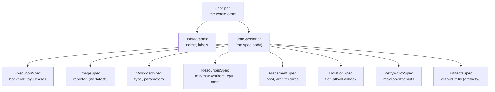
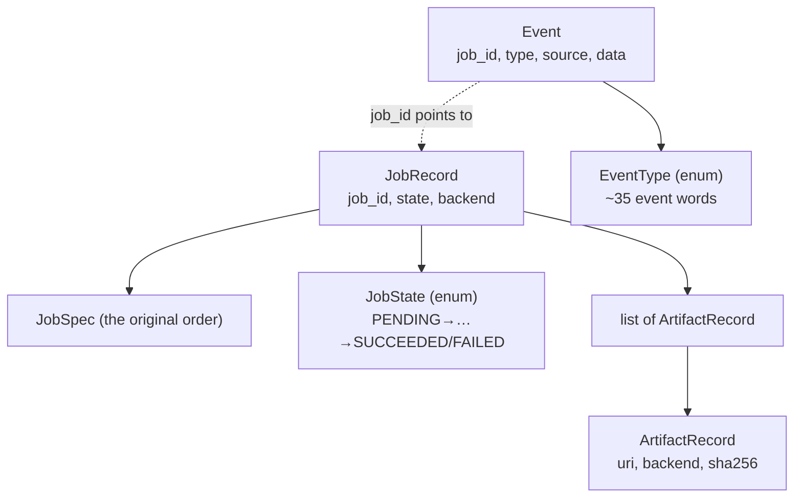
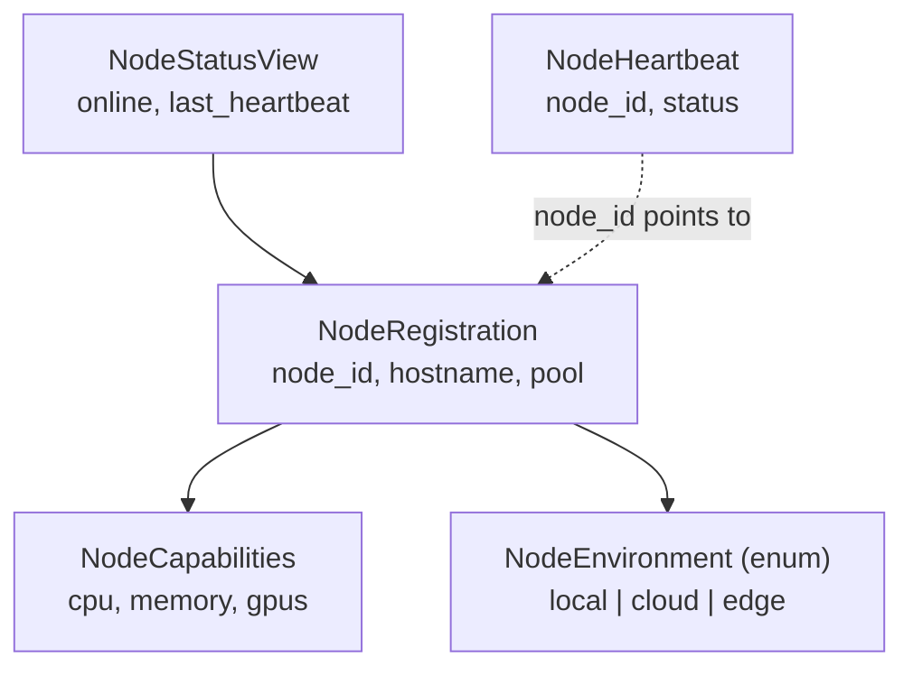
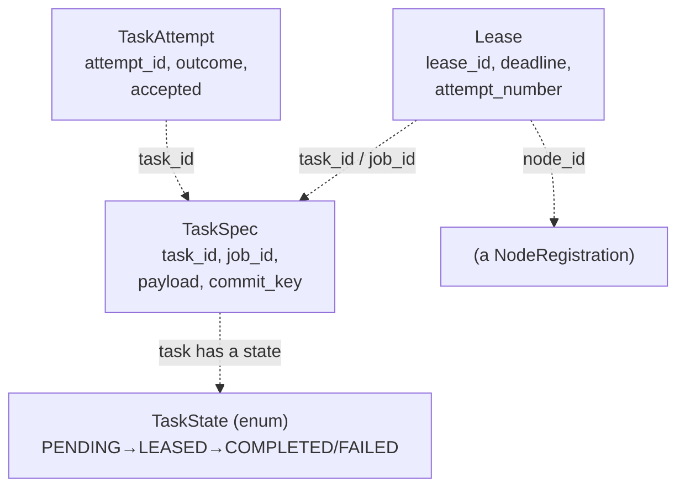
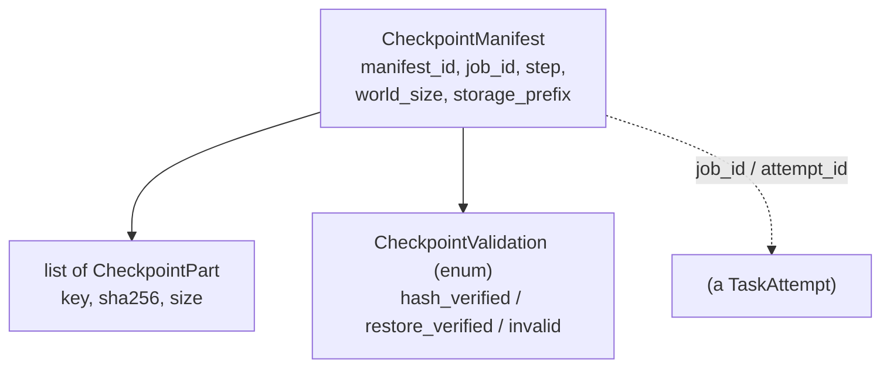
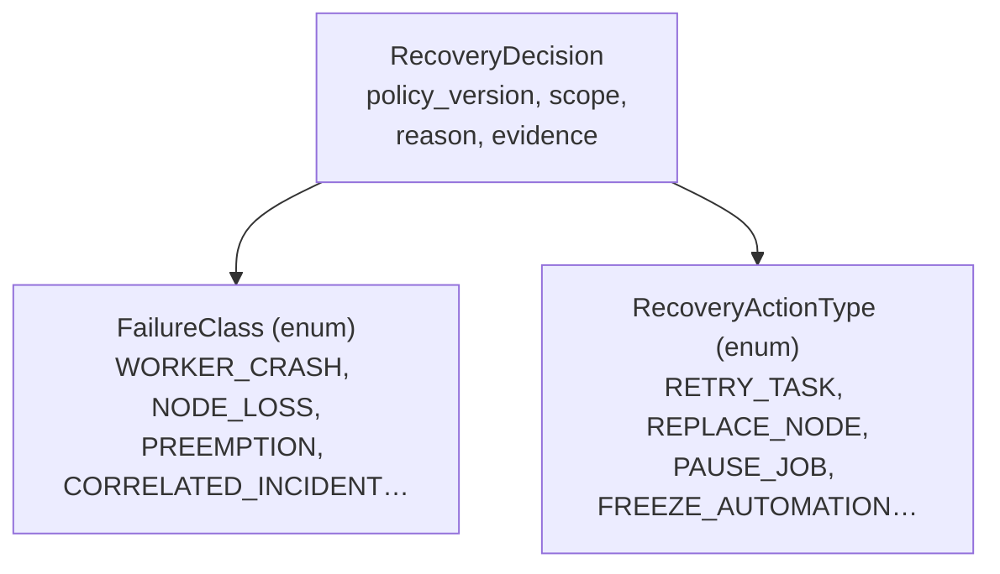
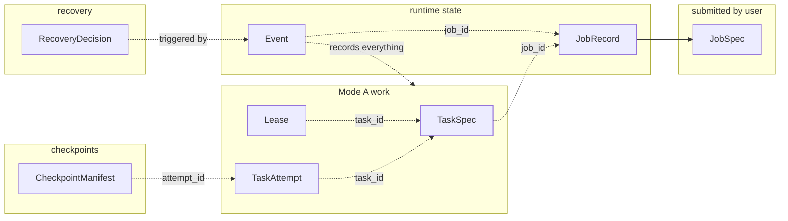

# `protocol/v1alpha1.py` — Class Map, Cheat Sheet & Plain-English Guide

> **Audience:** humans learning the system *and* AI agents working in the repo.
> **What this file documents:** `flashruntime/protocol/v1alpha1.py` — the shared
> *vocabulary* of the whole FlashML system.

---

## 0. Read this first — what this file is (and isn't)

Every class in `v1alpha1.py` is a pydantic `BaseModel` (a validated data
struct) or an `Enum` (a fixed list of allowed values). **It holds descriptions
only — no behavior, no orchestration, no calls to other modules.** It imports
nothing from the runtime; the runtime imports *it*.

- Think **database schema / dictionary**, not "engine".
- The thing that *does* stuff (receives a job, hands out work, reacts to
  failures) is the **coordinator** in `service/` — not this file.
- Because it's pure, dependency-free vocabulary, it's the public package the
  sibling repos (`flashnode`, `flashml-cloud`) import. Arrows only point
  **toward** protocol; it points at nobody.

```
service/  ──imports──▶  protocol/   ◀──imports──  leases/, checkpoint/, recovery/
(coordinator,           (just data          (behavior — DOES things, using
 DOES things)            definitions)        protocol's nouns)
                             ▲
        flashnode/ , flashml-cloud/ ──import──┘   (same vocabulary, other repos)
```

### Jargon primer (words used everywhere)

| Word | Plain meaning |
|------|---------------|
| **Spec** | "specification" = a *description of what you want* (a filled-in form). Does nothing by itself. |
| **Record** | what *actually exists* — a spec plus live tracking (id, status, timestamps). |
| **Enum** | a *fixed menu* of allowed values; nothing else is legal (like a dropdown). |
| **Manifest** | a *packing list* that proves a set of files is complete (not the files themselves). |
| **Ledger** | an *append-only logbook* — you only ever add lines, never edit or delete. |
| **Idempotent** | doing it twice has the same effect as doing it once (no duplicates / double-counting). |

### A running analogy: a big food-delivery kitchen 🍳

The whole system maps cleanly onto a kitchen, and this guide uses it throughout:

> A customer places an **order** (`JobSpec`). The kitchen chops it into individual
> **dishes** (`Task`s). Cooks **grab a ticket** for a dish (`Lease`) rather than
> being handed one, keep shouting "still cooking!" (**heartbeat**), and every
> single thing that happens is written in the **kitchen logbook** (`Event`).
> If a cook goes silent, their dish ticket **expires** and another cook grabs it.

---

## 1. Two kinds of "connection" (the #1 thing to understand)

Classes link together in **two different ways**. Confusing them is the biggest
source of misunderstanding.

- **`──▶` Composition (solid):** class A literally *contains* a B object as a
  field. Real Python object nesting. (Mostly inside the job-submission form.)
- **`- - ▶` Logical reference (dashed):** class A holds a **string id**
  (`job_id`, `task_id`, `commit_key`, `attempt_id`…) that *points at* another
  record — exactly like a **foreign key** in a database. No Python object link;
  the coordinator matches them by id at runtime.

So the real "map" of this file is a **database ER-diagram**, not a class tree.

---

## 2. The 6 families of classes (map)

| # | Family | Kitchen analogy | Classes |
|---|--------|-----------------|---------|
| 1 | **Job submission** | the customer's order form | `JobSpec`, `JobMetadata`, `JobSpecInner`, + 8 sub-specs |
| 2 | **Lifecycle & events** | the order ticket + kitchen logbook | `JobState`, `EventType`, `Event`, `JobRecord`, `ArtifactRecord` |
| 3 | **Nodes** | cooks clocking in for a shift | `NodeEnvironment`, `NodeCapabilities`, `NodeRegistration`, `NodeHeartbeat`, `NodeStatusView` |
| 4 | **Mode A: leases** | grabbing a dish ticket & cooking it | `TaskState`, `TaskSpec`, `Lease`, `TaskAttempt` |
| 5 | **Checkpoints** | saving a half-cooked dish safely | `CheckpointPart`, `CheckpointValidation`, `CheckpointManifest` |
| 6 | **Failure & recovery** | what to do when a cook drops a plate | `FailureClass`, `RecoveryActionType`, `RecoveryDecision` |

---

## Family 1 — Job submission (the order form)

`JobSpec` is the top-level object a user submits. Built by **composition** —
nested specs all the way down. Shaped like a Kubernetes manifest on purpose
(`apiVersion` / `kind` / `metadata` / `spec`). **Building one does nothing** —
it just produces a validated description that the coordinator later acts on.



| Class | Simple meaning (kitchen) | Key fields / rules |
|-------|--------------------------|--------------------|
| `JobSpec` | the whole customer order | `apiVersion`, `kind="Job"`, `metadata`, `spec` |
| `JobMetadata` | the label on the order | `name` **must be a DNS-1123 label** (lowercase, no spaces — safe in URLs), `labels` |
| `JobSpecInner` | the order's body | groups the 8 specs below |
| `ExecutionSpec` | *how* to cook it | `backend`: `ray` (coordinated / Mode B) or `leases` (Mode A). **This picks the mode.** |
| `ImageSpec` | which exact recipe box (container) | `repository` + `tag`; **rejects `latest`** (must pin an exact version for reproducibility); `.reference` = `"repo:tag"` |
| `WorkloadSpec` | *what dish* to make | `type` (e.g. `hyperparameter_search`), free-form `parameters` |
| `ResourcesSpec` | *how big* | `minimumWorkers`/`maximumWorkers` (max ≥ min), `cpuPerTask`, `memoryPerTask` |
| `PlacementSpec` | *where* to cook | `pool` (any/local/edge/cloud), `architectures` (amd64/arm64) |
| `IsolationSpec` | *how safely* | `tier` standard or `sandboxed` (locked-down, for untrusted code) |
| `RetryPolicySpec` | *how forgiving* | `maxTaskAttempts` before giving up, `retryWorkerLoss` |
| `ArtifactsSpec` | *where results go* | `outputPrefix`; **must start `artifact://`** (storage-neutral) |

---

## Family 2 — Lifecycle & events (the order ticket + logbook)

The user submits a `JobSpec`; the runtime wraps it in a **`JobRecord`** (the
order ticket: adds an id, a state, a results list). Everything that happens is
written as an **`Event`** in an append-only logbook.

> 🔑 **The append-only ledger rule.** The logbook is *write-only*. You never
> erase or edit a line, and you never hand-set a job's status. To know the
> truth, you **replay the log from the top**. This is the single most important
> design principle in the whole system: *state is derived from history, never
> from a field someone might have set wrong.*



| Class | Simple meaning | Notes |
|-------|----------------|-------|
| `JobState` (enum) | the order's status | PENDING → SUBMITTED → RUNNING → (RECOVERING) → SUCCEEDED / FAILED / CANCELLED. `.terminal` = one of the 3 final ones. |
| `EventType` (enum) | **the master word-list** for the logbook | ~35 fixed "words": JOB_ACCEPTED, LEASE_CLAIMED, LEASE_EXPIRED, TASK_REQUEUED, CHECKPOINT_MANIFEST_COMMITTED, FAILURE_CLASSIFIED, … Every module emits *these*; none invents its own. |
| `Event` | one line in the logbook | `job_id`, `type`, `timestamp`, `source` (which raw signal it came from — so evidence is traceable, never fabricated), `message`, `data` |
| `ArtifactRecord` | a receipt for one saved output file | `uri` (`artifact://…`), `backend`, `sha256` (fingerprint to catch corruption), `size_bytes` |
| `JobRecord` | the full order ticket | wraps `JobSpec` + `state` + `artifacts`; this is what the dashboard shows |

---

## Family 3 — Nodes (cooks clocking in)

A **node** = one worker machine (a spare GPU, a cloud box, an edge device).
These classes are how a machine says "I exist" and "I'm still alive."



| Class | Simple meaning |
|-------|----------------|
| `NodeEnvironment` (enum) | where the cook works: local / cloud / edge |
| `NodeCapabilities` | the cook's skills & equipment: cpu_cores, memory, gpus, os, architecture |
| `NodeRegistration` | *"Hi, I'm here for my shift"* — sent once on join (id, hostname, capabilities, pool) |
| `NodeHeartbeat` | *"still here"* — a tiny message sent repeatedly; status online/draining/terminating. Stops → assumed dead. |
| `NodeStatusView` | the manager's view of a cook: registration + is-online + last heartbeat time |

---

## Family 4 — Mode A leases (the heart of fault tolerance) ⭐

The core idea: **work is never pushed onto a worker — workers pull it.** A big
order (Job) is chopped into many independent **Tasks**; cooks *grab a ticket*
(Lease) for a dish, and the ticket **expires** if they go silent.

> **The source explains itself:** read the comment block at `v1alpha1.py`
> lines 311–318 — the whole pattern in one paragraph.



**The lease "dance" — the one flow to memorize (it's the whole product):**

```
1. TaskSpec created            state = PENDING   (dish on the board, grab-able)
2. worker claims  → Lease      state = LEASED    (deadline = now + lease_seconds)
3. worker heartbeats → renew    deadline pushed forward
   3a. worker DIES → stops renewing → deadline passes → LEASE_EXPIRED
                    → task returns to PENDING → another worker grabs it (requeue)
4. worker commits → TaskAttempt  accepted = true → state = COMPLETED
   4a. a late 2nd commit under the same commit_key → REJECTED   ← idempotency
```

> 🔑 **Why this is the magic:** a dead worker needs **zero special handling**.
> Nobody has to detect the death and reassign work — the lease just expires on
> its own and the task becomes grab-able again. Fault tolerance for free.

| Class | Simple meaning | The important field |
|-------|----------------|---------------------|
| `TaskState` (enum) | one dish's status | PENDING (grab-able) / LEASED / COMPLETED / FAILED / CANCELLED |
| `TaskSpec` | one dish's recipe card | **`commit_key`** = the "one plate per dish" rule: only ONE finished result may ever be accepted for this task |
| `Lease` | *"this dish is mine for 60 s"* — a time-bounded right | **`deadline`** (each heartbeat renews it), `attempt_number` |
| `TaskAttempt` | one try at cooking the dish | **`accepted`** flips true only on the *winning* commit; `outcome`, `output_sha256` |

**Glossary for this family:**
- **Task** — one unit of independent work (one dish).
- **commit_key** — the idempotency anchor; guarantees no duplicate results.
- **Lease** — a *time-bounded* right to attempt one task; the time-bound is what makes death self-healing.
- **Attempt** — one try; a task may be attempted several times if workers keep dying (capped by `max_attempts`).

---

## Family 5 — Checkpoints (saving progress safely)

A **checkpoint** = a saved snapshot of progress, so a long job doesn't restart
from zero after a crash.

> **The source explains itself:** read `v1alpha1.py` lines 372–378 — a
> checkpoint is *not a path*, it's a **manifest** proving completeness.



> 🔑 **The golden rule: parts first, manifest LAST.** The files (parts) upload
> first; the manifest (packing list) is written only *after* every part's
> fingerprint verifies. So **no manifest ⇒ no checkpoint** — if a crash happens
> mid-save, there's no manifest, and the half-written garbage is simply ignored.
> You can never accidentally restore from a corrupt half-save.

| Class | Simple meaning |
|-------|----------------|
| `CheckpointPart` | one file in the snapshot: `key` (name), `sha256` (fingerprint), `size_bytes` |
| `CheckpointValidation` (enum) | trust ladder: `hash_verified` (files present & match) → `restore_verified` (we actually loaded it and it worked) → `invalid` (quarantined; recovery must NEVER pick it) |
| `CheckpointManifest` | the packing list proving the save is complete: list of parts + validation + `world_size` and `compatible_world_sizes` (which worker-counts it can be reloaded into, via resharding — save on 4 machines, resume on 8) |

---

## Family 6 — Failure & recovery (typed decisions, no guessing)

When something breaks: **classify** the failure into a bucket, then **decide** a
typed action from a fixed policy table. Both are just data here; the logic lives
in `recovery/`.



> 🔑 **Typed + logged, never an LLM.** Every decision is reproducible: the same
> failure + same `policy_version` always yields the same action. No AI guessing,
> no randomness — so you can always audit *exactly* why the system acted.

| Class | Simple meaning |
|-------|----------------|
| `FailureClass` (enum) | **the diagnosis** — 13 buckets a break falls into: `application_error`, `worker_crash`, `node_loss`, `preemption` (cloud reclaimed a cheap machine), `communication_error`, `correlated_incident` (many things failing at once — dangerous), … `unknown` |
| `RecoveryActionType` (enum) | **the prescription** — 6 typed responses: `retry_task` (cheap; Mode A), `restart_group` (whole group from checkpoint; expensive; Mode B), `replace_node` (bad machine → get a new one), `pause_job` (e.g. storage down — stop burning money), `fail_job` (real user bug → stop & tell them), `freeze_automation` (too many failures → stop auto-retrying, get a human — prevents retry storms) |
| `RecoveryDecision` | **the signed verdict**: which class → which action, at what `scope` (task/node/group/job/pool), with `reason`, `evidence`, and `policy_version` |

> **Mode changes the prescription.** The same failure gets a *different* action
> depending on the job's mode: a worker crash in **Mode A** → `retry_task` (the
> others don't even notice); in **Mode B** → `restart_group` (they were in
> lockstep, so everyone restarts). That's why `recovery.decide(failure, mode)`
> takes the mode as an input. (See `docs/SYSTEM_OVERVIEW.md` for Modes 0/A/B/C.)

---

## 3. The whole file at a glance — the id web

The families don't nest into each other; they **link by shared string ids**,
like tables in a database. This is the single most important structural insight.



> 🔑 **`job_id` is the spine.** A `JobRecord` has one; every `Event`,
> `TaskSpec`, `Lease`, `TaskAttempt`, and `CheckpointManifest` carries the same
> `job_id`, so the coordinator can gather one job's whole story from otherwise-
> separate tables. Below job_id: `task_id` links tasks → leases → attempts, and
> `attempt_id` links attempts → checkpoints.

---

## 4. Constants (top of file)

| Name | Value | Why |
|------|-------|-----|
| `API_VERSION` | `flashml.dev/v1alpha1` | stamped on every JobSpec |
| `SCHEMA_VERSION` | `v1alpha1` | stamped on every wire message |
| `LABEL_*` | `flashml.dev/job-id`, … | labels put on backend resources for tracing |
| `_NAME_RE` | regex | enforces DNS-1123 job names |
| `utcnow()` | helper | the file's one function — timezone-aware timestamps |

---

## 5. Versioning discipline (why it's `v1alpha1`)

- `apiVersion` (on JobSpec) and `schema_version` (on wire messages) identify
  this revision. **Additive changes are allowed** within `v1alpha1` (e.g. the
  July 2026 blocks marked "additive"); **breaking changes require a new module**
  (`v1alpha2`, …). This is why new EventTypes were *appended*, never renamed.
- Deployment-private details (cluster IDs, credentials, storage keys, namespaces)
  are **deliberately absent** — they belong to backend/deployment config, never
  the public spec. That's what keeps this file safe to open-source.

---

## 6. Where to go next (reading path)

This file is **Stage 1** (the vocabulary). Once it's comfortable:

1. **Stage 2 — `leases/manager.py`**: watch the lease dance actually run.
2. **Stage 3 — `checkpoint/catalog.py` + `recovery/`**: the safety machinery.
3. **Stage 4 — `service/modea.py` + `service/app.py`**: the coordinator that
   *uses* all these nouns over HTTP.
4. **Stage 5 — `planner/`**: the explainable "how should I run this?" advisor.
